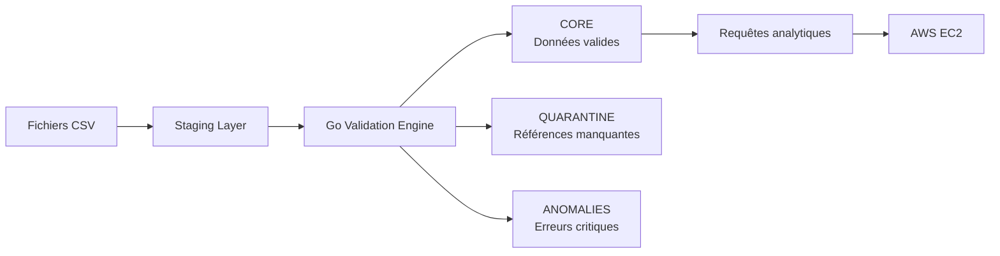
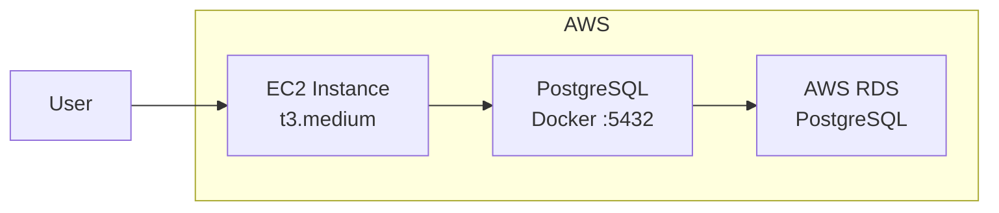
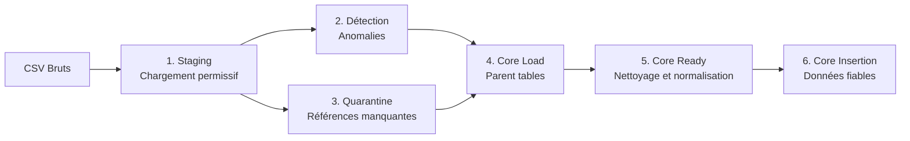
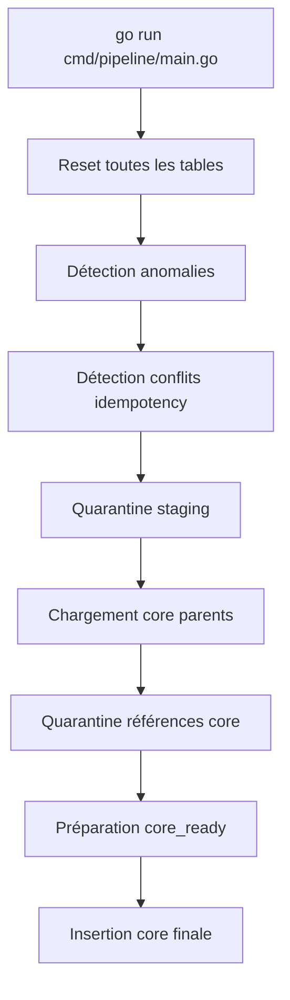
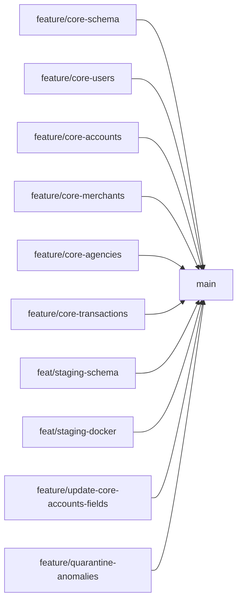

# NAFAD PAY — G1 OLTP Pipeline


## 1. Présentation du projet

**NAFAD PAY** est un pipeline de données complet construit autour d'un système OLTP de paiement.

L'objectif du projet est de concevoir et implémenter une architecture de traitement de données en couches, depuis l'ingestion brute jusqu'au stockage fiable et interrogeable.

Le système prend en entrée des données brutes issues de fichiers CSV (utilisateurs, comptes, transactions, marchands, agences) et applique :

- un **chargement exhaustif** dans une couche staging permissive
- une **validation et un routage** automatisé des lignes
- une **séparation stricte** entre données valides, quarantaine et anomalies
- un **stockage fiable** dans une base core contrainte
- des **requêtes analytiques** et un déploiement cloud sur AWS EC2

Ce projet combine :

- PostgreSQL (base de données relationnelle)
- Go (moteur d'automatisation du pipeline)
- Docker (environnement reproductible)
- Terraform (infrastructure as code)
- AWS EC2 + RDS (déploiement cloud)


## 2. Architecture technique globale

L'architecture est organisée en couches distinctes et séquentielles.

Chaque couche a un rôle précis et ne mélange pas les responsabilités :

- **Staging** : exhaustif, permissif, sans rejet
- **Validation** : moteur de règles Go
- **Core** : strict, fiable, contraint
- **Quarantine** : références manquantes
- **Anomalies** : erreurs critiques

### Diagramme global




## 3. Infrastructure Cloud



Les données sont stockées sur AWS RDS (PostgreSQL managé).
PostgreSQL tourne dans un conteneur Docker sur l'instance EC2.


## 4. Pipeline de données

Le pipeline s'exécute en 6 étapes séquentielles orchestrées par Go.



### Règles de routage

```
SI anomalie critique     → ANOMALIES
SI référence manquante   → QUARANTINE
SINON                    → CORE

Priorité : ANOMALIES > QUARANTINE > CORE
```

Cette priorité garantit qu'aucune ligne n'appartient à deux catégories à la fois.


## 5. Schéma de base de données

### Couche Staging (permissive)

Toutes les colonnes sont de type `TEXT`.
Aucune contrainte appliquée.
Toutes les lignes sont préservées exactement.

| Table | Lignes chargées |
|-------|----------------|
| `staging.users` | 1 000 |
| `staging.accounts` | 1 099 |
| `staging.merchants` | 100 |
| `staging.agencies` | 50 |
| `staging.transactions` | 10 000 |
| `staging.reference_wilayas` | 15 |
| `staging.reference_tx_types` | 8 |
| `staging.reference_categories` | 13 |

### Couche Core (stricte)

Les tables core appliquent des contraintes strictes :

| Table | Contraintes principales |
|-------|------------------------|
| `core.users` | NNI 10 chiffres, phone `+222XXXXXXXX`, wilaya FK |
| `core.accounts` | balance ≥ 0, currency = MRU, user FK |
| `core.merchants` | code unique, category FK, wilaya FK |
| `core.agencies` | code unique, float_balance ≥ 0, wilaya FK |
| `core.transactions` | amount > 0, status valide, idempotency unique, FKs complètes |

### Tables de référence

| Table | Contenu |
|-------|---------|
| `reference.wilayas` | 15 régions |
| `reference.tx_types` | 8 types de transaction |
| `reference.categories` | 13 catégories marchands |


## 6. Validation et résultats

### Anomalies détectées

| Type | Nombre |
|------|--------|
| Transactions avec montant ≤ 0 | 52 |
| Conflits d'idempotency (clé dupliquée + payload différent) | 6 416 |

### Quarantine

| Type | Nombre |
|------|--------|
| Références manquantes (compte, marchand, agence) | 3 505 |

### Core

| Table | Lignes insérées |
|-------|----------------|
| `core.users` | 995 |
| `core.accounts` | 1 087 |
| `core.merchants` | 100 |
| `core.agencies` | 50 |
| `core.transactions` | 66 (40 SUCCESS · 26 FAILED) |

### Vérifications de non-chevauchement

| Vérification | Résultat |
|-------------|---------|
| Overlap anomalies / quarantine | 0  |
| Overlap idempotency / quarantine | 0  |
| Montants invalides dans core | 0  |
| Balances invalides dans core | 0  |
| Références manquantes dans core | 0  |
| Violations FK lors de l'insertion | 0  |


## 7. Moteur Go (Automation Engine)

Go est le moteur central du pipeline. Il orchestre toutes les étapes dans le bon ordre.



### Commande d'exécution

```bash
go run eda/cmd/pipeline/main.go
```

Le pipeline est reproductible : il repart de zéro à chaque exécution grâce au `TRUNCATE` initial.

---

## 8. Structure du projet

```plaintext
nafadpay-g1-oltp/
│
├── sql/
│   ├── reference/
│   │   └── 01_reference_schema.sql
│   ├── staging/
│   │   ├── 00_staging_schema.sql
│   │   ├── 01_stg_users.sql
│   │   ├── 02_stg_accounts.sql
│   │   ├── 03_stg_merchants.sql
│   │   ├── 04_stg_agencies.sql
│   │   ├── 05_stg_transactions.sql
│   │   ├── 06_stg_reference_wilayas.sql
│   │   ├── 07_stg_reference_tx_types.sql
│   │   └── 08_stg_reference_categories.sql
│   ├── core/
│   │   ├── 01_core_users.sql
│   │   ├── 02_core_accounts.sql
│   │   ├── 03_core_transactions.sql
│   │   ├── 04_core_merchants.sql
│   │   └── 05_core_agencies.sql
│   ├── anomalies/
│   │   ├── 01_transaction_anomalies.sql
│   │   ├── 02_idempotency_conflicts.sql
│   │   ├── 03_detect_transaction_anomalies.sql
│   │   ├── 04_detect_idempotency_conflicts.sql
│   │   ├── 05_insert_transaction_anomalies.sql
│   │   └── 06_insert_idempotency_conflicts.sql
│   ├── quarantine/
│   │   ├── 01_quarantine_transactions.sql
│   │   ├── 02_quarantine_reasons.sql
│   │   ├── 03_detect_quarantine_transactions.sql
│   │   ├── 04_insert_quarantine_transactions.sql
│   │   └── 05_insert_core_reference_quarantine.sql
│   ├── core_load/
│   │   ├── 01_insert_core_users.sql
│   │   ├── 02_insert_core_accounts.sql
│   │   ├── 03_insert_core_merchants.sql
│   │   └── 04_insert_core_agencies.sql
│   ├── core_ready/
│   │   ├── 01_prepare_core_transactions.sql
│   │   └── 02_insert_core_transactions.sql
│   └── tests/
│       ├── 00_staging_smoke_test.sql
│       └── 01_validation_routing_checks.sql
│
├── eda/
│   └── cmd/
│       └── pipeline/
│           └── main.go
│
├── docker/
│   └── docker-compose.yml
│
├── scripts/
│   ├── bootstrap.sh
│   ├── bootstrap.ps1
│   ├── init_staging.sh
│   ├── init_staging.ps1
│   ├── load_reference.sh
│   ├── load_reference.ps1
│   ├── load_raw.sh
│   ├── load_raw.ps1
│   ├── run_validation_route.sh
│   └── run_validation_route.ps1
│
├── terraform/
│   ├── main.tf
│   ├── variables.tf
│   └── outputs.tf
│
├── docs/
│   ├── anomaly_pipeline.md
│   ├── early_stage.md
│   └── at_scale.md
│
├── data/
│   ├── shared/
│   │   ├── reference_wilayas.csv
│   │   ├── reference_tx_types.csv
│   │   └── reference_categories.csv
│   └── G1_OLTP/
│       ├── users_sample.csv
│       ├── accounts_sample.csv
│       ├── merchants_sample.csv
│       ├── agencies_sample.csv
│       └── transactions_sample.csv
│
├── validation_route.sql
├── .env
├── .gitignore
└── README.md
```


## 9. Structure Git

Le projet utilise une organisation en branches par fonctionnalité :

- `main` : branche principale, production
- `feature/core-schema` : schéma core initial
- `feature/core-users` : table et contraintes users
- `feature/core-accounts` : table et contraintes accounts
- `feature/core-merchants` : table et contraintes merchants
- `feature/core-agencies` : table et contraintes agencies
- `feature/core-transactions` : table et contraintes transactions
- `feat/staging-schema` : création des tables staging
- `feat/staging-docker` : setup Docker et scripts de chargement
- `feature/update-core-accounts-fields` : mise à jour des champs core accounts
- `feature/quarantine-anomalies` : implémentation anomalies et quarantine

Chaque fonctionnalité est développée sur une branche dédiée, puis mergée vers `main` via Pull Request.




## 10. Variables d'environnement

Les variables sensibles ne sont jamais committées dans le code.

Créer un fichier `.env` à la racine (**ne jamais commiter**) :

```env
POSTGRES_USER=admin
POSTGRES_PASSWORD=xxx
POSTGRES_DB=nafadpay
AWS_ACCESS_KEY_ID=xxx
AWS_SECRET_ACCESS_KEY=xxx
AWS_DEFAULT_REGION=eu-west-3
```

Le `.gitignore` doit contenir :

```
.env
*.pem
data/G1_OLTP/
```


## 11. Installation et exécution

### Prérequis

- Docker + Docker Compose
- Go 1.21+
- PostgreSQL client (`psql`)
- AWS CLI configuré

### Cloner le projet

```bash
git clone <repo_url>
cd nafadpay-g1-oltp
```

### Lancer le bootstrap complet

```bash
# Linux / EC2
bash scripts/bootstrap.sh

# Windows
.\scripts\bootstrap.ps1
```

Le bootstrap :

- démarre PostgreSQL dans Docker
- attend que la base soit prête
- crée le schéma staging
- charge les données de référence
- charge les données brutes G1

### Vérifier le chargement (smoke test)

```bash
# Linux
Get-Content sql/tests/00_staging_smoke_test.sql -Raw | \
  docker exec -i nafadpay-postgres psql -U admin -d nafadpay -f -
```

### Lancer le pipeline de validation

```bash
# Linux
bash scripts/run_validation_route.sh

# Windows
.\scripts\run_validation_route.ps1
```

### Lancer le pipeline Go complet

```bash
go run eda/cmd/pipeline/main.go
```

### Lancer les tests de validation

```bash
Get-Content sql/tests/01_validation_routing_checks.sql -Raw | \
  docker exec -i nafadpay-postgres psql -U admin -d nafadpay -f -
```


## 12. Déploiement sur AWS EC2

### Connexion à l'instance

```bash
ssh ubuntu@<EC2_PUBLIC_IP>
```

### Lancer PostgreSQL sur EC2

```bash
cd nafadpay-g1-oltp
docker-compose -f docker/docker-compose.yml up -d
```

### Exécuter le pipeline sur EC2

```bash
bash scripts/bootstrap.sh
go run eda/cmd/pipeline/main.go
```

### Accès à la base

```bash
docker exec -it nafadpay-postgres psql -U admin -d nafadpay
```


## 13. Infrastructure Terraform

Le provisionnement de l'instance EC2 est géré par Terraform.

```bash
cd terraform/
terraform init
terraform plan
terraform apply
```

Les fichiers Terraform créent :

- une instance EC2 (t3.medium, Ubuntu 22.04)
- un security group (ports 22, 5432 ouverts)
- une configuration réseau de base

Les variables sensibles sont passées via `terraform.tfvars` (**ne jamais commiter**).


## 14. Performance et indexation

15 index ont été créés sur les tables core pour optimiser les requêtes analytiques.

| Table | Index | Type |
|-------|-------|------|
| `core.transactions` | `idx_tx_source_account`, `idx_tx_date`, `idx_tx_status` | Simples |
| `core.transactions` | `idx_tx_account_date`, `idx_tx_status_date`, `idx_tx_merchant_status` | Composites |
| `core.accounts` | `idx_accounts_user`, `idx_accounts_status` | Simples |
| `core.users` | `idx_users_wilaya` | Simple |
| `core.merchants` | `idx_merchants_wilaya`, `idx_merchants_category` | Simples |
| `core.agencies` | `idx_agencies_wilaya` | Simple |

**Résultats EXPLAIN ANALYZE :**

- Q1 (historique utilisateur) : `Index Scan` → **0.174ms** ✅
- Q13 (totaux quotidiens) : `Seq Scan` → **0.240ms** ✅ (normal sur 66 lignes — bascule automatique sur index en production)


## 15. Choix techniques

| Choix | Raison |
|-------|--------|
| PostgreSQL | Base relationnelle robuste avec contraintes FK/CHECK |
| Staging TEXT-only | Éviter tout rejet prématuré de données brutes |
| Go | Performance, simplicité et orchestration fiable |
| Docker | Environnement reproductible local et EC2 |
| Terraform | Infrastructure versionnable et reproductible |
| Scripts `.sh` + `.ps1` | Compatibilité Windows et Linux/EC2 |
| Priorité ANOMALIES > QUARANTINE | Déterminisme du routage, zéro chevauchement |


## 16. Rôles de l'équipe

| Membre | Rôle | Responsabilités |
|--------|------|----------------|
| Member 1 | Core Database Owner | Schéma core, contraintes, tables de référence |
| Member 2 | Staging & Loading Engine | Tables staging, Docker, scripts bootstrap, smoke test |
| Member 3 | Validation & Routing | Règles anomalies/quarantine, pipeline Go, core_ready |
| Member 4 | Queries & Performance & AWS | Requêtes analytiques, indexes, déploiement EC2 |
| Member 5 | Documentation & Architecture & Terraform | README, early_stage, at_scale, fichiers Terraform |


## 17. Limitations

- Seulement **66 transactions** atteignent le core sur 10 000 — 64.2% sont des conflits d'idempotency
- **0 transaction marchande** dans core (toutes rejetées par le pipeline — à corriger par Membre 3)
- **349 comptes** avec `available_balance > balance` — incohérence à corriger (Membre 1)
- Noms marchands affichant `undefined` dans les données CSV sources (Membre 1)
- Le pipeline Go repart de zéro à chaque exécution (TRUNCATE complet — non scalable)


## 18. Améliorations futures

- Résolution des conflits d'idempotency pour augmenter le taux de transactions en core
- Ajout d'un système de monitoring des pipelines (alertes, logs structurés)
- Migration vers AWS RDS pour la couche core en production
- Partitionnement des tables transactions par date
- Ajout de tests unitaires Go pour chaque règle de validation
- Dashboard de visualisation des métriques de qualité des données


## 19. Conclusion

Ce projet met en pratique les concepts d'ingénierie de données en construisant un pipeline complet, de la donnée brute jusqu'au stockage fiable et interrogeable.

L'approche est modulaire, reproductible et extensible, ce qui constitue une base solide pour des systèmes de données en production.

> **"staging is exhaustive — core is trusted"**
