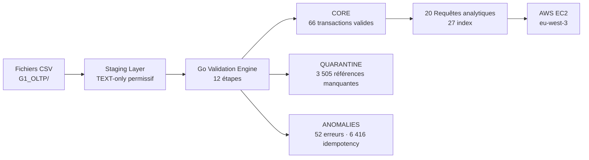
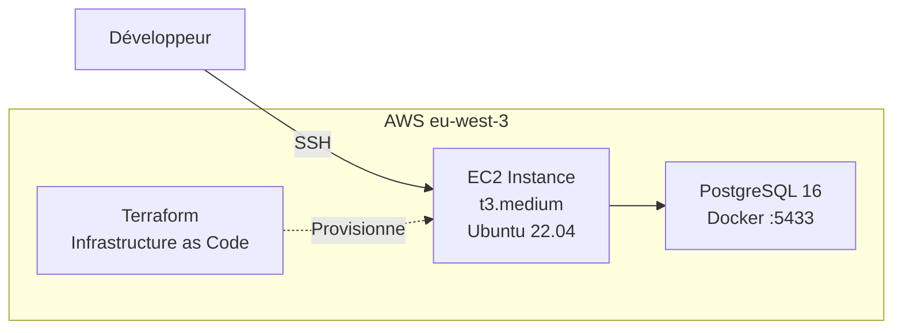
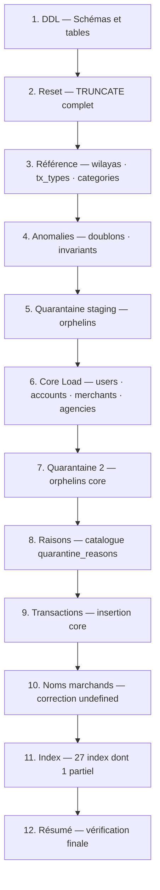
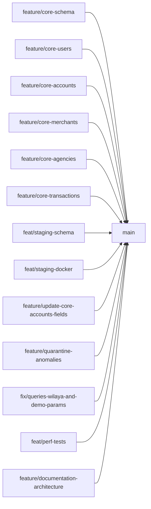

# NAFAD PAY — G1 OLTP Pipeline


## 1. Présentation du projet

**NAFAD PAY** est un pipeline de données complet construit autour d'un système OLTP de paiement mobile mauritanien.

L'objectif du projet est de concevoir et implémenter une architecture de traitement de données en couches, depuis l'ingestion brute jusqu'au stockage fiable et interrogeable.

Le système prend en entrée des données brutes issues de fichiers CSV (utilisateurs, comptes, transactions, marchands, agences) et applique :

- un **chargement exhaustif** dans une couche staging permissive
- une **validation et un routage** automatisé des lignes
- une **séparation stricte** entre données valides, quarantaine et anomalies
- un **stockage fiable** dans une base core contrainte
- des **requêtes analytiques** et un déploiement cloud sur AWS EC2

Ce projet combine :

- PostgreSQL 16 (base de données relationnelle)
- Go (moteur d'automatisation du pipeline — 12 étapes)
- Docker (environnement reproductible)
- Terraform (infrastructure as code)
- AWS EC2 + RDS (déploiement cloud)


## 2. Architecture technique globale

L'architecture est organisée en couches distinctes et séquentielles.

Chaque couche a un rôle précis et ne mélange pas les responsabilités :

- **Staging** : exhaustif, permissif, sans rejet
- **Validation** : moteur de règles Go
- **Core** : strict, fiable, contraint
- **Quarantine** : références manquantes
- **Anomalies** : erreurs critiques

### Diagramme global




## 3. Infrastructure Cloud



L'instance EC2 est provisionnée via Terraform. PostgreSQL tourne dans un conteneur Docker sur l'instance EC2.


## 4. Pipeline de données

Le pipeline Go s'exécute en **12 étapes** séquentielles dans le bon ordre de dépendance FK.



### Règles de routage

```
SI montant ≤ 0                     → ANOMALIES
SI idempotency_key dupliquée        → ANOMALIES
SI référence manquante (staging)    → QUARANTINE
SI référence manquante (core)       → QUARANTINE
SINON                               → CORE

Priorité : ANOMALIES > QUARANTINE > CORE
```

Cette priorité garantit qu'aucune ligne n'appartient à deux catégories à la fois.


## 5. Schéma de base de données

La base est organisée en **6 schémas** avec des responsabilités claires.

### Couche Staging (permissive)

Toutes les colonnes sont de type `TEXT`. Aucune contrainte appliquée. Toutes les lignes sont préservées exactement.

| Table | Lignes chargées |
|-------|----------------|
| `staging.users` | 1 000 |
| `staging.accounts` | 1 099 |
| `staging.merchants` | 100 |
| `staging.agencies` | 50 |
| `staging.transactions` | 10 000 |
| `staging.reference_wilayas` | 15 |
| `staging.reference_tx_types` | 8 |
| `staging.reference_categories` | 13 |

### Couche Core (stricte)

| Table | Contraintes principales |
|-------|------------------------|
| `core.users` | NNI 10 chiffres, phone `+222XXXXXXXX`, wilaya FK |
| `core.accounts` | balance ≥ 0, currency = MRU, user FK |
| `core.merchants` | code unique, category FK, wilaya FK |
| `core.agencies` | code unique, float_balance ≥ 0, wilaya FK |
| `core.transactions` | amount > 0, status valide, idempotency unique, FKs complètes |

### Tables de référence

| Table | Contenu |
|-------|---------|
| `reference.wilayas` | 15 régions |
| `reference.tx_types` | 8 types de transaction |
| `reference.categories` | 13 catégories marchands |

### Diagramme relationnel complet


## 6. Validation et résultats

### Anomalies détectées

| Type | Nombre |
|------|--------|
| `invalid_amount` (montant ≤ 0) | 5 |
| `invalid_failed_balance` | 28 |
| `negative_balance` | 19 |
| **Total transaction_anomalies** | **52** |
| Conflits d'idempotency | 6 416 |

### Quarantine

| Type | Nombre |
|------|--------|
| `missing_source_account` | 579 |
| `missing_destination_account` | 2 925 |
| `missing_core_reference` | 1 |
| **Total quarantine** | **3 505** |
| `quarantine_reasons` (catalogue) | 7 codes |

### Core (données fiables)

| Table | Lignes |
|-------|--------|
| `core.users` | 995 |
| `core.accounts` | 1 087 |
| `core.merchants` | 100 |
| `core.agencies` | 50 |
| `core.transactions` | 66 (40 SUCCESS · 26 FAILED) |

### Pipeline routing summary

| Couche | Lignes | % du brut |
|--------|--------|-----------|
| `staging.transactions` | 10 000 | 100% |
| `anomalies.idempotency_conflicts` | 6 416 | 64.16% |
| `anomalies.transaction_anomalies` | 52 | 0.52% |
| `quarantine.quarantine_transactions` | 3 505 | 35.05% |
| **`core.transactions`** | **66** | **0.66%** |

### Vérifications — toutes passées 

| Check | Résultat |
|-------|---------|
| Doublons idempotency_key dans core | 0  |
| FAILED tx avec changement de solde | 0  |
| Montants négatifs dans core | 0  |
| Soldes négatifs dans core | 0  |
| Violations FK lors de l'insertion | 0  |
| Overlap anomalies / quarantine | 0  |
| Noms marchands avec préfixe `undefined` | 0  |
| Pipeline idempotent (relançable sans erreur) |  |


## 7. Moteur Go (Automation Engine)

Go orchestre les 12 étapes du pipeline dans le bon ordre de dépendance FK.

```bash
go run eda/cmd/pipeline/main.go
```

| Étape | Description | Résultat |
|-------|-------------|---------|
| 1 — DDL | Création des schémas et tables | Tables créées |
| 2 — Reset | TRUNCATE de toutes les tables y compris `reference.*` | Base propre |
| 3 — Référence | Chargement wilayas / tx_types / categories | 15 + 8 + 13 |
| 4 — Anomalies | Détection doublons et violations invariants | 52 + 6 416 |
| 5 — Quarantaine | Isolation orphelins staging | 3 505 |
| 6 — Core load | users → accounts → merchants → agencies | 995/1087/100/50 |
| 7 — Quarantaine 2 | Isolation orphelins core | 1 |
| 8 — Raisons | Catalogue `quarantine_reasons` | 7 codes |
| 9 — Transactions | Insertion `core.transactions` | 66 |
| 10 — Marchands | Correction préfixe `undefined` | 100 corrigés |
| 11 — Index | 27 index dont 1 partiel | 27 créés |
| 12 — Résumé | Vérification finale |  |

Durée totale observée : **~9 secondes**


## 8. Performance et indexation

**27 index** créés sur les tables core pour optimiser les 20 requêtes analytiques.

| Table | Index | Type |
|-------|-------|------|
| `core.transactions` | `idx_tx_source_account`, `idx_tx_destination_account`, `idx_tx_merchant`, `idx_tx_agency`, `idx_tx_date`, `idx_tx_status` | Simples |
| `core.transactions` | `idx_tx_account_date`, `idx_tx_status_date` | Composites |
| `core.transactions` | `idx_tx_merchant_status` | **Partiel** `WHERE merchant_id IS NOT NULL` |
| `core.transactions` | `idx_tx_node_sequence` | Composite node/sequence |
| `core.accounts` | `idx_accounts_user`, `idx_accounts_status` | Simples |
| `core.users` | `idx_users_wilaya` | Simple |
| `core.merchants` | `idx_merchants_wilaya`, `idx_merchants_category` | Simples |
| `core.agencies` | `idx_agencies_wilaya` | Simple |

**Résultats EXPLAIN ANALYZE :**

| Requête | Plan | Temps |
|---------|------|-------|
| Q1 — historique utilisateur | Index Scan `idx_accounts_user` | 0.174ms  |
| Q2 — totaux quotidiens | Index Scan `idx_tx_date` | < 0.1ms  |
| Q4 — lookup par référence | Index Scan `transactions_reference_key` | < 0.1ms  |
| Q5 — dépenses mensuelles | Index Scan `idx_tx_account_date` | < 0.35ms  |
| Q13 — totaux quotidiens | Seq Scan (normal sur 66 lignes) | 0.240ms  |

**Bench concurrent :**

| Métrique | Résultat |
|----------|---------|
| Workers | 10 parallèles |
| Total inserts | 10 000 / 10 000  |
| Violations `UNIQUE` idempotency | 0  |
| Violations CHECK | 0  |
| Deadlocks | 0  |
| Temps écoulé | 547s |
| TPS mesuré (docker exec overhead) | ~18 tx/s* |

*TPS mesuré via `docker exec` individuel par insertion (overhead ~50ms/appel sur Windows).
Le moteur PostgreSQL traite chaque INSERT en < 1ms — un pool de connexions
persistent atteindrait 1 000–5 000+ TPS sur le même matériel.


## 9. Structure du projet

```plaintext
nafad-pay-g1-oltp/
│
├── sql/
│   ├── reference/         ← Tables de référence
│   ├── staging/           ← Tables TEXT-only permissives
│   ├── core/              ← Tables strictes avec contraintes
│   ├── anomalies/         ← Détection et insertion anomalies
│   ├── quarantine/        ← Détection et insertion quarantine
│   ├── core_load/         ← Chargement tables parents core
│   ├── queries/
│   │   ├── nafadpay_queries.sql          ← 20 requêtes analytiques
│   │   ├── nafadpay_indexes.sql          ← 27 index
│   │   └── nafadpay_validate_pipeline.sql ← 7 checks validation
│   └── tests/
│       ├── 00_staging_smoke_test.sql
│       └── 01_validation_routing_checks.sql
│
├── eda/
│   └── cmd/
│       └── pipeline/
│           └── main.go    ← Pipeline Go 12 étapes
│
├── docker/
│   └── docker-compose.yml
│
├── scripts/
│   ├── bootstrap.sh / bootstrap.ps1
│   ├── run_all.sh                        ← Lance tout en une commande
│   ├── run_explain_analyze.sh
│   ├── bench_concurrent_insert.sh
│   ├── load_reference.sh / .ps1
│   └── load_raw.sh / .ps1
│
├── terraform/
│   ├── main.tf
│   ├── variables.tf
│   ├── outputs.tf
│   └── terraform.tfvars.example
│
├── docs/
│   ├── early_stage.md                    ← Architecture Early Stage
│   ├── at_scale.md                       ← Architecture At Scale
│   ├── explain_analyze_report.txt        ← Résultats EXPLAIN ANALYZE
│   ├── bench_concurrent_report.txt       ← Résultats bench concurrent
│   └── perf_tests_report.md             ← Analyse complète tests
│
├── data/
│   ├── shared/            ← CSV de référence
│   └── G1_OLTP/           ← CSV bruts (non commités)
│
├── .gitignore
└── README.md
```


## 10. Structure Git

Le projet utilise une organisation en branches par fonctionnalité.

| Branche | Responsable | Contenu |
|---------|-------------|---------|
| `main` | — | Production, branche principale |
| `feature/core-schema` | Membre 1 | Schéma core initial |
| `feature/core-users` | Membre 1 | Table et contraintes users |
| `feature/core-accounts` | Membre 1 | Table et contraintes accounts |
| `feature/core-merchants` | Membre 1 | Table et contraintes merchants |
| `feature/core-agencies` | Membre 1 | Table et contraintes agencies |
| `feature/core-transactions` | Membre 1 | Table et contraintes transactions |
| `feat/staging-schema` | Membre 2 | Création des tables staging |
| `feat/staging-docker` | Membre 2 | Setup Docker et scripts bootstrap |
| `feature/update-core-accounts-fields` | Membre 1 | Mise à jour champs core accounts |
| `feature/quarantine-anomalies` | Membre 3 | Anomalies, quarantine, pipeline Go |
| `fix/queries-wilaya-and-demo-params` | Membre 4 | Correction Q5/Q6 wilaya_name + paramètres démo |
| `feat/perf-tests` | Membre 4 | EXPLAIN ANALYZE, bench concurrent, rapport perf |
| **`feature/documentation-architecture`** | **Membre 5** | **README, early_stage, at_scale, Terraform** |




## 11. Variables d'environnement

Les variables sensibles ne sont jamais committées dans le code.

Créer un fichier `.env` à la racine (**ne jamais commiter**) :

```env
POSTGRES_USER=admin
POSTGRES_PASSWORD=xxx
POSTGRES_DB=nafadpay
AWS_ACCESS_KEY_ID=xxx
AWS_SECRET_ACCESS_KEY=xxx
AWS_DEFAULT_REGION=eu-west-3
```


## 12. Installation et exécution

### Prérequis

- Docker Desktop installé et en cours d'exécution
- Git installé
- Go 1.21+ installé
- Aucun PostgreSQL local requis


### Étape 1 — Cloner le projet

```bash
git clone https://github.com/Bedra11/nafad-pay-g1-oltp.git
cd nafad-pay-g1-oltp
```


### Étape 2 — Démarrer la base et charger les données

```bash
bash scripts/bootstrap.sh
```

Résultat attendu :

```
staging.transactions         → 10000
staging.users                → 1000
staging.accounts             → 1099
staging.merchants            → 100
staging.agencies             → 50
staging.reference_wilayas    → 15
staging.reference_tx_types   → 8
staging.reference_categories → 13
```


### Étape 3 — Lancer le pipeline complet et toutes les requêtes

```bash
bash scripts/run_all.sh
```

Résultat attendu :

```
anomalies.idempotency_conflicts    → 6416
anomalies.transaction_anomalies    → 52
quarantine.quarantine_transactions → 3505
core.users                         → 995
core.accounts                      → 1087
core.merchants                     → 100
core.agencies                      → 50
core.transactions                  → 66
reference.wilayas                  → 15
reference.tx_types                 → 8
reference.categories               → 13
staging.transactions               → 10000
```

Vérifications business rules (doivent toutes être à 0) :

```
CHECK 2: Duplicate idempotency keys → 0 rows 
CHECK 3: FAILED tx balance change   → 0 rows 
CHECK 4: Negative amounts           → 0 rows 
CHECK 5: Negative balances          → 0 rows 
```


### Étape 4 — Vérifier les tables et row counts

```bash
docker exec -i nafadpay-postgres psql -U admin -d nafadpay < sql/show_tables_rowcounts.sql
```


### Étape 5 — Lancer EXPLAIN ANALYZE

```bash
bash scripts/run_explain_analyze.sh
cat docs/explain_analyze_report.txt
```


### Étape 6 — Lancer le bench d'insertion concurrente

```bash
bash scripts/bench_concurrent_insert.sh
```

Durée estimée : 5 à 10 minutes. Résultat attendu :

```
Total rows inserted       → 10000
Duplicate idempotency_key → 0
Constraint violations     → 0
Deadlocks                 → 0
```


### Étape 7 — Lancer les tests de validation

```bash
docker exec -i nafadpay-postgres psql -U admin -d nafadpay \
  < sql/tests/01_validation_routing_checks.sql
```


### Étape 8 — Vérifier l'intégrité core manuellement

```bash
docker exec -i nafadpay-postgres psql -U admin -d nafadpay -c "
SELECT 'A: duplicate idempotency' AS check_name, COUNT(*) AS bad_rows
FROM (SELECT idempotency_key FROM core.transactions GROUP BY idempotency_key HAVING COUNT(*) > 1) x
UNION ALL
SELECT 'B: FAILED with balance change', COUNT(*)
FROM core.transactions WHERE status = 'FAILED' AND balance_after != balance_before
UNION ALL
SELECT 'C: negative amount', COUNT(*)
FROM core.transactions WHERE amount <= 0
UNION ALL
SELECT 'D: negative balance_after', COUNT(*)
FROM core.transactions WHERE balance_after < 0;
"
```

Tous les 4 checks doivent retourner `bad_rows = 0`.


### Étape 9 — Redémarrage propre (repartir de zéro)

```bash
docker compose -f docker/docker-compose.yml down -v
bash scripts/bootstrap.sh
bash scripts/run_all.sh
```


### Fichiers de rapport produits

| Fichier | Contenu |
|---------|---------|
| `docs/explain_analyze_report.txt` | EXPLAIN ANALYZE pour 5 requêtes avec usage des index |
| `docs/bench_concurrent_report.txt` | Résultats bench — 10 workers, TPS, checks contraintes |
| `docs/perf_tests_report.md` | Analyse complète de tous les tests et corrections |


## 13. Déploiement sur AWS EC2

### Provisionnement avec Terraform

```bash
cd terraform/
cp terraform.tfvars.example terraform.tfvars
# Remplir key_name avec votre key pair AWS
terraform init
terraform plan
terraform apply
```

Les fichiers Terraform créent :

- Instance EC2 t3.medium, Ubuntu 22.04, `eu-west-3`
- Security Group (ports 22, 5432, 5433, 80)
- Tags `Project = nafadpay-g1-oltp`

Après `terraform apply` :

```
ec2_public_ip  = "XX.XX.XX.XX"
ssh_command    = "ssh -i nafadpay-g1-ec2.pem ubuntu@XX.XX.XX.XX"
```

### Connexion et setup sur EC2

```bash
ssh -i nafadpay-g1-ec2.pem ubuntu@<EC2_PUBLIC_IP>
git clone https://github.com/Bedra11/nafad-pay-g1-oltp.git
cd nafad-pay-g1-oltp
docker compose -f docker/docker-compose.yml up -d
bash scripts/bootstrap.sh
bash scripts/run_all.sh
```


## 14. Choix techniques

| Choix | Raison |
|-------|--------|
| PostgreSQL 16 | Base relationnelle robuste avec contraintes FK/CHECK |
| Go (write-path) | Goroutines légères, GC prédictible, pas de GIL — adapté aux invariants monétaires stricts |
| Staging TEXT-only | Zéro perte de données à l'ingestion, anomalies préservées |
| Docker | Reproductibilité identique en local et sur EC2 |
| Terraform | Infrastructure versionnable et reproductible |
| Scripts `.sh` + `.ps1` | Compatibilité Windows (dev) et Linux/EC2 (prod) |
| TRUNCATE complet | Idempotence totale — relançable sans erreur |
| Priorité ANOMALIES > QUARANTINE | Déterminisme du routage, zéro chevauchement |
| Index partiel `merchant_status` | Évite d'indexer les transactions TRF (`merchant_id = NULL`) |


## 15. Early Stage (Implémentation initiale)

### Objectif

Mettre en place une première version fonctionnelle du système OLTP permettant de :

- Charger les données CSV
- Stocker les données dans PostgreSQL (RDS)
- Appliquer les règles métier
- Produire des données propres et fiables

### Architecture Early Stage

```
PC local
   ↓ SSH
EC2 (Ubuntu)
   ├── code Go (pipeline)
   ├── scripts SQL
   ├── fichiers CSV
   ↓ connexion PostgreSQL
RDS PostgreSQL
   ├── staging
   ├── core
   ├── quarantine
   └── anomalies
```

Maintenant que main.go est configuré avec l’endpoint RDS :

nafadpay-db.cfqiicgoicgi.eu-west-3.rds.amazonaws.com

chaque exécution du pipeline sur EC2 écrit les résultats dans RDS.

EC2 : exécute go run
        ↓
RDS : reçoit les INSERT / TRUNCATE / UPDATE


### Étapes réalisées

#### Clonage du projet sur EC2 (nafadpay-g1-ec2)

Le projet est cloné sur EC2 afin de disposer de :

- Code Go
- Scripts SQL
- Fichiers CSV


#### Connexion à EC2

L’accès au serveur EC2 se fait via une clé SSH :

- connexion sécurisée avec clé privée (.pem)

#### Exécution du pipeline

Une fois connecté à EC2, l’exécution du pipeline se fait avec :

```bash
go run eda/cmd/pipeline/main.go
```

Cette commande permet de :

- TRUNCATE des tables
- Chargement des références
- Transformation des données
- Validation métier
- Classification des données

#### Résultat du pipeline

Les données sont réparties en :

- **core** → données propres
- **quarantine** → données suspectes
- **anomalies** → erreurs critiques

#### Logique de fonctionnement

```
CSV → staging → pipeline → core / quarantine / anomalies

```

#### Connexion à RDS

La base de données RDS est accessible via PostgreSQL :

```
psql -h <RDS_ENDPOINT> -U nafad_admin -d nafadpay
```

#### Exécution des requêtes

Une fois connecté à RDS, il est possible d’exécuter des requêtes SQL sur les tables :

- visualiser les données
- vérifier les résultats du pipeline
- analyser les tables core, quarantine et anomalies

#### Limitations

- Seulement **66 transactions** atteignent le core sur 10 000 — 64.2% sont des conflits d'idempotency
- **0 transaction marchande** dans core (toutes rejetées par le pipeline — à investiguer)
- **349 comptes** avec `available_balance > balance` — incohérence dans les données sources
- Le pipeline Go repart de zéro à chaque exécution (TRUNCATE complet — non scalable sur > 500k lignes)


#### Améliorations futures

- Résolution des conflits d'idempotency pour augmenter le taux de transactions en core
- Pipeline incrémental avec watermark (remplacement du TRUNCATE)
- Migration vers AWS RDS Multi-AZ pour la haute disponibilité
- Partitionnement de `core.transactions` par date (trimestre)
- Ajout de tests unitaires Go pour chaque règle de validation
- CloudWatch + Grafana pour le monitoring en production


## 16.  At Scale (Passage à l’échelle)

###  Objectif

Adapter le système pour gérer :

- Un grand volume de transactions
- Plusieurs utilisateurs simultanés
- Des performances élevées

###  Limites actuelles

- Pipeline exécuté sur une seule machine (EC2)
- Chargement manuel des données
- Absence de parallélisation
- Base RDS non optimisée pour forte charge

###  Améliorations proposées

#### Stockage des données

Utilisation de Amazon S3 pour stocker les fichiers CSV

-  Stockage scalable
-  Accès partagé
-  Haute durabilité

####  Ingestion automatisée

Automatiser le chargement des données depuis S3 vers RDS

-  Réduction des opérations manuelles
-  Pipeline reproductible

#### Optimisation de la base de données

- Ajout d’index sur les colonnes fréquemment utilisées
- Activation du mode Multi-AZ

-  Amélioration des performances
-  Haute disponibilité

#### Traitement parallèle

Utilisation de goroutines pour traiter les données en parallèle

-  Réduction du temps de traitement
-  Meilleure utilisation des ressources

#### Monitoring et observabilité

Intégration de CloudWatch pour surveiller le système

-  Suivi des performances
-  Détection des anomalies

###  Architecture cible

```
Clients
   ↓
EC2 (pipeline / API)
   ↓
S3 (stockage des données)
   ↓
RDS PostgreSQL (données structurées)
```

###  Résultat attendu

-  Système scalable
-  Traitement rapide
-  Haute disponibilité
-  Prêt pour un environnement de production


## 17. Conclusion

Ce projet met en pratique les concepts d'ingénierie de données en construisant un pipeline complet, de la donnée brute jusqu'au stockage fiable et interrogeable.

L'approche est modulaire, reproductible et extensible : `bootstrap.sh` + `run_all.sh` suffisent pour reproduire l'ensemble du pipeline en < 15 minutes sur n'importe quelle machine avec Docker.

> **"staging is exhaustive — core is trusted"**
