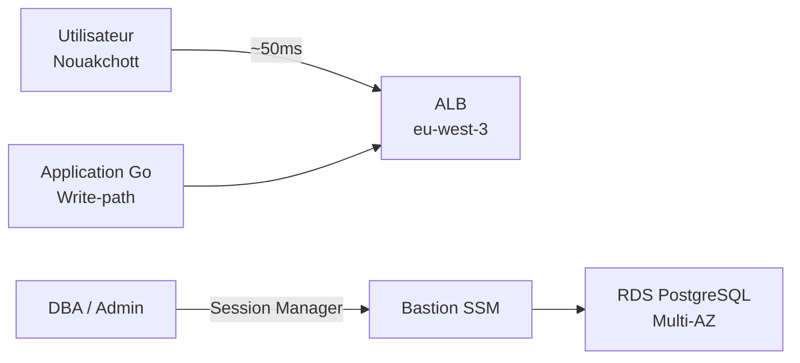
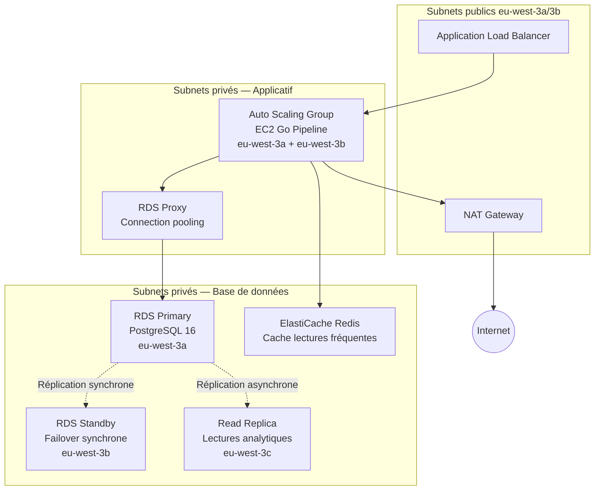
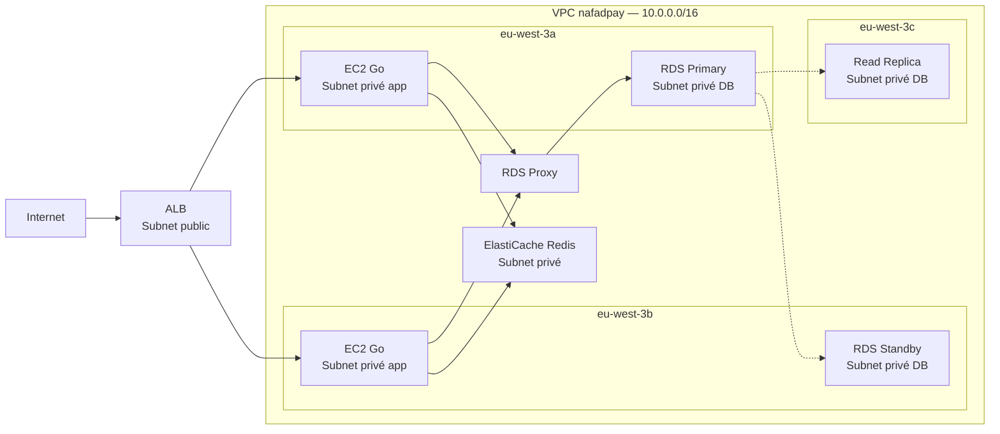
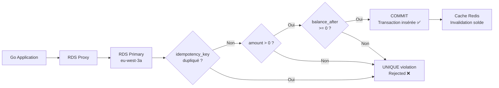
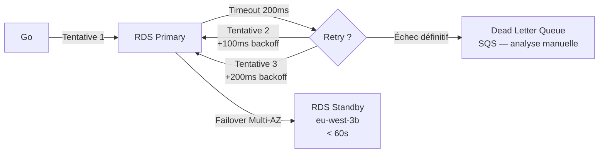
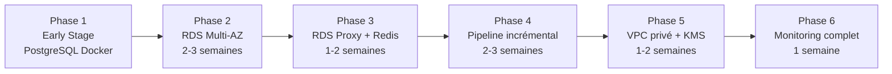

# Document d'Architecture — G1 OLTP — At Scale


## 1. Contexte & contraintes

### Charge visée

| Dimension | Valeur At Scale |
|-----------|----------------|
| Débit nominal | 500 QPS en pic |
| Volume transactions | 5 millions tx/mois |
| Utilisateurs actifs | 500 000 |
| Disponibilité cible | 99.9% (< 9h downtime/an) |
| Latence p50 | < 100ms |
| Latence p99 | < 500ms |
| Déploiement | Multi-AZ (eu-west-3a, eu-west-3b, eu-west-3c) |

### SLA / SLO

| Indicateur | Valeur |
|-----------|--------|
| Disponibilité | 99.9% (RDS Multi-AZ + Auto Scaling) |
| RPO | 5 minutes (PITR RDS) |
| RTO | 30 minutes (failover automatique < 60s + validation) |
| Durée de rétention backup | 7 jours PITR + copie cross-region `eu-west-1` mensuelle |

### Contraintes non-fonctionnelles

- Budget estimé : ~$200-250/mois (justifié pour 500k users)
- Compliance BCM : RPO 5 min, RTO 30 min, données chiffrées at-rest (KMS) et in-transit (TLS 1.3)
- Latence structurante : Nouakchott ↔ Paris ≈ 40-60ms incompressible → cache pour les lectures répétitives, confirmation asynchrone pour les opérations non critiques
- Pas de datacenter AWS en Mauritanie → région cible `eu-west-3` (Paris, ~4 000km) — le plus proche, francophone, 3 AZ disponibles
- AWS uniquement (`eu-west-3`) — pas de GCP, Snowflake, Databricks

### Hypothèses explicites

- Le volume atteint 5M tx/mois après 12 mois de croissance
- Les 500k users génèrent en moyenne 10 tx/mois chacun
- Le write-path (ledger, mouvements d'argent) reste en Go — pas Python (GIL, typage dynamique)
- La latence 40-60ms Nouakchott ↔ Paris est acceptable avec cache Redis pour les lectures fréquentes
- Les nœuds fictifs des données CSV (`DC-NKC-PRIMARY`, `DC-NKC-SECONDARY`, `DC-NDB`) correspondent respectivement à `eu-west-3a`, `eu-west-3b`, `eu-west-3c`


## 2. Diagramme d'architecture (C4 simplifié)

### Niveau 1 — System Context



### Niveau 2 — Containers (architecture cible)



### Diagramme réseau détaillé



> RDS dans un subnet **privé**, aucune IP publique. Accès uniquement via RDS Proxy depuis le SG applicatif. Aucune connexion directe d'un dev en prod — passage obligatoire par AWS Session Manager.


## 3. Choix techniques & alternatives rejetées (ADR-lite)

### ADR-01 — AWS RDS PostgreSQL Multi-AZ plutôt que Docker EC2

**Contexte :** À 500 QPS et 500k users, une panne EC2 est inacceptable.

**Décision :** AWS RDS PostgreSQL 16, instance `db.m7g.large` (Graviton, prix/perf optimal), Multi-AZ avec standby synchrone en `eu-west-3b`.

**Alternatives rejetées :**
- *PostgreSQL Docker sur EC2* → pas de HA, backup manuel, failover en heures
- *AWS Aurora PostgreSQL* → 3x plus cher, sur-dimensionné pour < 5k TPS en écriture
- *Hetzner bare-metal* → 80% moins cher mais 0 managed backup, 0 failover automatique, incompatible avec les contraintes RPO/RTO

**Justification :** RDS Multi-AZ assure un failover automatique < 60s, des backups PITR automatiques, et un chiffrement KMS natif. Le surcoût (~$60/mois vs ~$30/mois EC2) est justifié pour garantir RPO 5 min et RTO 30 min.


### ADR-02 — RDS Proxy pour le connection pooling

**Contexte :** À 500 QPS avec 10 workers Go par instance, le nombre de connexions PostgreSQL sature rapidement (`max_connections` par défaut ~100).

**Décision :** RDS Proxy devant RDS Primary — mutualise les connexions, failover transparent.

**Alternatives rejetées :**
- *PgBouncer sur EC2* → configuration manuelle, pas de failover automatique intégré avec RDS
- *Connexions directes* → `max_connections` saturé à ~200 QPS

**Justification :** RDS Proxy réduit les connexions à la DB de 80% et assure la continuité lors d'un failover Multi-AZ sans modification du code applicatif.


### ADR-03 — ElastiCache Redis pour les lectures fréquentes

**Contexte :** La latence Nouakchott ↔ Paris (~50ms) est incompressible. Les lectures répétitives (solde compte, historique récent) ne doivent pas toutes aller en base.

**Décision :** ElastiCache Redis (`cache.t3.micro`) pour cacher les soldes et l'historique des 50 dernières transactions par utilisateur. TTL = 30 secondes.

**Alternatives rejetées :**
- *Pas de cache* → chaque lecture frappe RDS, saturation à ~200 QPS
- *Memcached* → pas de persistance, pas de structures de données riches

**Justification :** 80% des lectures sont répétitives (même utilisateur consulte son solde plusieurs fois). Redis absorbe ce trafic sans toucher RDS.


### ADR-04 — Partitionnement natif PostgreSQL par transaction_date

**Contexte :** À 5M tx/mois, `core.transactions` atteint 60M lignes en 12 mois. Les requêtes de reporting scannent toute la table.

**Décision :** Partitionnement `PARTITION BY RANGE (transaction_date)` par trimestre.

```sql
CREATE TABLE core.transactions (
    id BIGSERIAL, amount NUMERIC, transaction_date DATE NOT NULL, ...
) PARTITION BY RANGE (transaction_date);

CREATE TABLE core.transactions_2024_q1
    PARTITION OF core.transactions
    FOR VALUES FROM ('2024-01-01') TO ('2024-04-01');
```

**Alternatives rejetées :**
- *Pas de partitionnement* → Seq Scan sur 60M lignes en reporting
- *Sharding applicatif* → complexité excessive pour < 5k TPS, prévu si > 5k TPS (signal Aurora)

**Justification :** Le partitionnement natif PostgreSQL permet l'archivage par détachement de partition et réduit les scans de reporting à la seule partition concernée.


### ADR-05 — Pipeline incrémental avec watermark

**Contexte :** Le TRUNCATE complet est non scalable sur 5M tx/mois.

**Décision :** Pipeline incrémental — traite uniquement les nouvelles lignes depuis `last_processed_at`.

**Alternatives rejetées :**
- *TRUNCATE complet* → O(n) sur tout le volume, bloquant pendant des heures
- *Event sourcing* → sur-ingénierie, complexité excessive pour ce projet

**Justification :** Le watermark permet de traiter les nouvelles transactions en quelques secondes sans bloquer la base.


### ADR-06 — Sécurité : KMS + Secrets Manager + IAM moindre privilège

**Contexte :** Système de paiement avec données sensibles (NNI, phone, soldes).

**Décision :**
- Chiffrement at-rest : AWS KMS (CMK dédiée NAFAD-PAY, rotation annuelle)
- TLS 1.3 obligatoire, `rds.force_ssl = 1`
- Secrets dans AWS Secrets Manager (rotation automatique 30 jours via Lambda)
- Comptes PostgreSQL dédiés : `app_writer`, `app_reader`, `etl_loader` avec `GRANT` minimal
- Audit : `pgaudit` activé, logs vers CloudWatch Logs (rétention 90 jours)

**Alternatives rejetées :**
- *Fichier `.env`* → risque d'exposition dans Git, pas de rotation automatique


## 4. Flux critiques

### Happy path — transaction validée à 500 QPS



### Gestion d'un échec / retry / timeout



### Idempotence — comment est-elle garantie ?

**Niveau base de données :** Contrainte `UNIQUE` sur `idempotency_key` dans `core.transactions` — garantit qu'aucun doublon ne peut être inséré même sous charge concurrente. Validé par bench : 10 workers × 1 000 inserts simultanés → 0 violation.

**Niveau pipeline :** Mode incrémental avec watermark — une transaction déjà traitée ne peut pas être retraitée car son `idempotency_key` existe déjà en core.

**Niveau applicatif :** Les clients Go utilisent `ON CONFLICT (idempotency_key) DO NOTHING` pour les retries — idempotent par construction.


## 5. Points de rupture connus & seuils de bascule

### Point de rupture 1 — RDS Single-AZ (si non configuré Multi-AZ)

**Seuil :** Première panne AZ

**Signal :** p99 > 500ms, erreurs de connexion > 1%

**Action :** Activer Multi-AZ (online, sans downtime sur RDS)


### Point de rupture 2 — Saturation RDS Proxy

**Seuil :** > 800 QPS

**Signal :** Connexions RDS Proxy > 80% du max, latence p99 > 500ms

**Action :** Scale up instance RDS Proxy, envisager Aurora si > 5k TPS écriture


### Point de rupture 3 — Partitions trop grandes

**Seuil :** Partition trimestrielle > 500M lignes

**Signal :** Requêtes sur une partition > 2s malgré les index

**Action :** Partitionnement mensuel, envisager Redshift pour le reporting analytique


### Point de rupture 4 — Cache Redis saturé

**Seuil :** Hit rate Redis < 60%, latence p99 > 300ms

**Signal :** Augmentation des connexions RDS malgré le cache

**Action :** Scale up ElastiCache, augmenter TTL ou taille du cache


### Point de rupture 5 — Write-path > 5 000 TPS

**Seuil :** > 5 000 TPS en écriture

**Signal :** CPU RDS Primary > 80%, réplication lag Standby > 100ms

**Action :** Migration vers Aurora PostgreSQL (multi-master) ou sharding applicatif


### Tableau résumé

| Point de rupture | Seuil | Signal | Action |
|-----------------|-------|--------|--------|
| RDS Single-AZ | Panne AZ | Connexions KO | Activer Multi-AZ |
| RDS Proxy saturé | 800 QPS | Latence p99 > 500ms | Scale up Proxy |
| Partitions trop grandes | 500M lignes/partition | Requêtes > 2s | Partitionnement mensuel |
| Redis saturé | Hit rate < 60% | Connexions RDS ↑ | Scale up ElastiCache |
| Write-path > 5k TPS | 5 000 TPS | CPU RDS > 80% | Aurora ou sharding |


## 6. Plan de migration (Early Stage → At Scale)

### Vue d'ensemble



### Phase 2 — Migration vers RDS Multi-AZ (2-3 semaines, ~10 personne-jours)

**Sans downtime :**
- Créer instance RDS PostgreSQL 16 Multi-AZ en `eu-west-3`
- Configurer la réplication depuis PostgreSQL Docker vers RDS via `pg_logical` ou `pg_dump/restore`
- Tester les connexions applicatives vers RDS

**Avec downtime planifié (< 30 min, heure creuse) :**
- Couper les écritures vers PostgreSQL Docker
- Valider la synchronisation RDS
- Basculer les connexions vers RDS
- Supprimer le conteneur Docker PostgreSQL

**Risque :** Incohérence de données pendant la bascule → mitigation : valider `SELECT COUNT(*)` sur toutes les tables avant/après


### Phase 3 — RDS Proxy + ElastiCache Redis (1-2 semaines, ~5 personne-jours)

**Sans downtime :**
- Déployer RDS Proxy devant RDS
- Déployer ElastiCache Redis
- Modifier le code Go pour utiliser Redis sur les lectures (`GET solde`, `GET historique`)
- Tester le hit rate Redis

**Risque :** Cache invalidation mal configurée → TTL trop long = soldes périmés → mitigation : invalidation explicite après chaque transaction


### Phase 4 — Pipeline incrémental (2-3 semaines, ~10 personne-jours)

**Sans downtime :**
- Ajouter table `pipeline.watermarks` dans PostgreSQL
- Réécrire le pipeline Go en mode incrémental
- Tester en parallèle (ancien pipeline TRUNCATE vs nouveau pipeline incrémental)
- Valider l'idempotence du nouveau pipeline

**Risque :** Double traitement pendant la transition → mitigation : `ON CONFLICT (idempotency_key) DO NOTHING`


### Phase 5 — VPC privé + KMS + Secrets Manager (1-2 semaines, ~5 personne-jours)

**Avec downtime planifié (< 60 min) :**
- Migrer RDS dans subnet privé (nécessite recréation du SG)
- Activer chiffrement KMS at-rest (snapshot chiffrée + restore)
- Migrer les secrets vers AWS Secrets Manager
- Configurer `pgaudit` + logs CloudWatch

**Risque :** Connectivité coupée lors du passage subnet public → privé → mitigation : tester avec une instance RDS de test avant


### Phase 6 — Monitoring complet (1 semaine, ~3 personne-jours)

**Sans downtime :**
- CloudWatch dashboards (CPU, connexions, latence p50/p99)
- Alarmes SNS (CPU > 70%, connexions > 80%, réplication lag > 30s)
- Grafana dashboard pour visualisation


## 7. Risques & mitigations

### Risque 1 — Compromission de l'application (`app_writer`)

**Probabilité :** Faible | **Impact :** Critique

**Scénario :** Un attaquant obtient les credentials `app_writer` via une fuite dans les logs ou le code.

**Mitigations :**
1. **IAM conditions** : `app_writer` ne peut se connecter que depuis les SG applicatifs EC2 — aucune connexion depuis Internet possible
2. **Blast radius limité** : `app_writer` n'a que `INSERT, UPDATE` sur les tables core — pas de `DROP`, `DELETE`, ni accès à `staging.*` ou `anomalies.*`
3. **Rotation automatique** : AWS Secrets Manager tourne les credentials tous les 30 jours via Lambda — un credentials exfiltré devient invalide rapidement


### Risque 2 — `DROP TABLE` accidentel par un développeur

**Probabilité :** Faible | **Impact :** Élevé

**Scénario :** Un développeur fait `DROP TABLE core.transactions` en production par erreur.

**Mitigations :**
1. **Aucune connexion directe en prod** : accès uniquement via AWS Session Manager avec logs d'audit CloudTrail — toute action DBA est tracée
2. **PITR RDS** : restauration point-in-time en < 30 min jusqu'à 5 min avant l'incident (RPO 5 min)
3. **Copie cross-region** : snapshot mensuel copié en `eu-west-1` — protection contre une corruption complète de `eu-west-3`


### Risque 3 — Fuite d'un snapshot S3 (backup)

**Probabilité :** Faible | **Impact :** Élevé

**Scénario :** Un bucket S3 contenant des backups `pg_dump` est rendu public par erreur.

**Mitigations :**
1. **Chiffrement at-rest** : tous les snapshots RDS sont chiffrés avec KMS (CMK NAFAD-PAY) — un snapshot exfiltré est illisible sans accès à la CMK KMS
2. **S3 Block Public Access** : activé sur tous les buckets backup — impossible de rendre un objet public accidentellement
3. **CloudTrail + Macie** : détection automatique de données PII exposées, alerte SNS en < 5 min si un bucket devient public


*NAFAD-PAY G1 OLTP — Document At Scale — Mai 2026*
