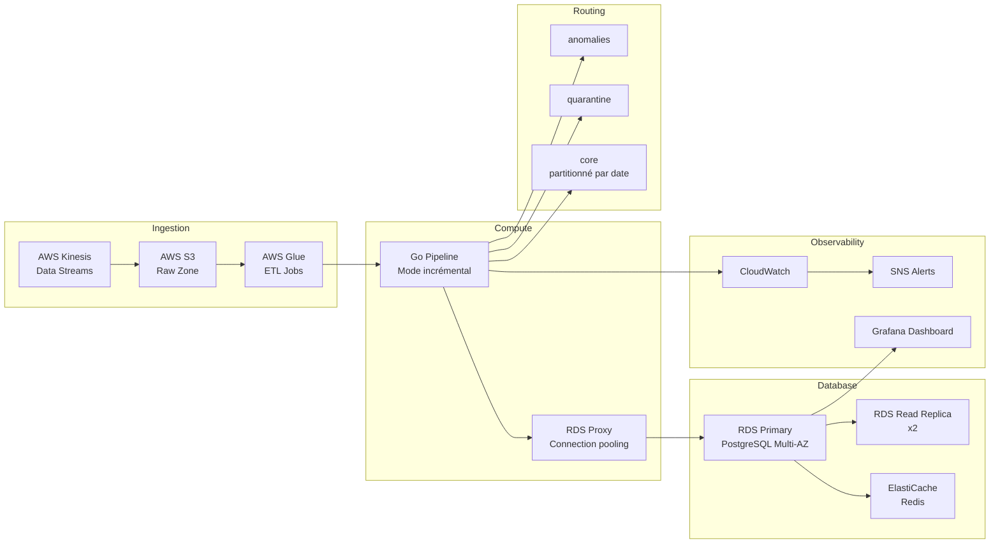
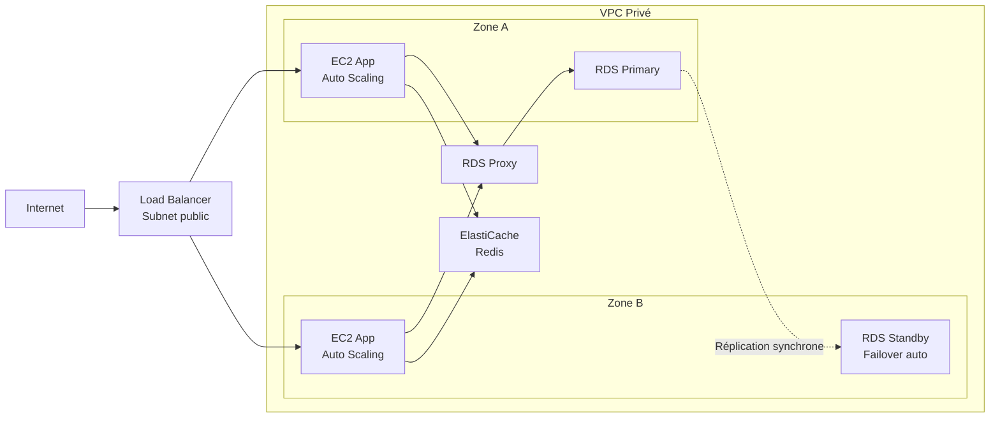
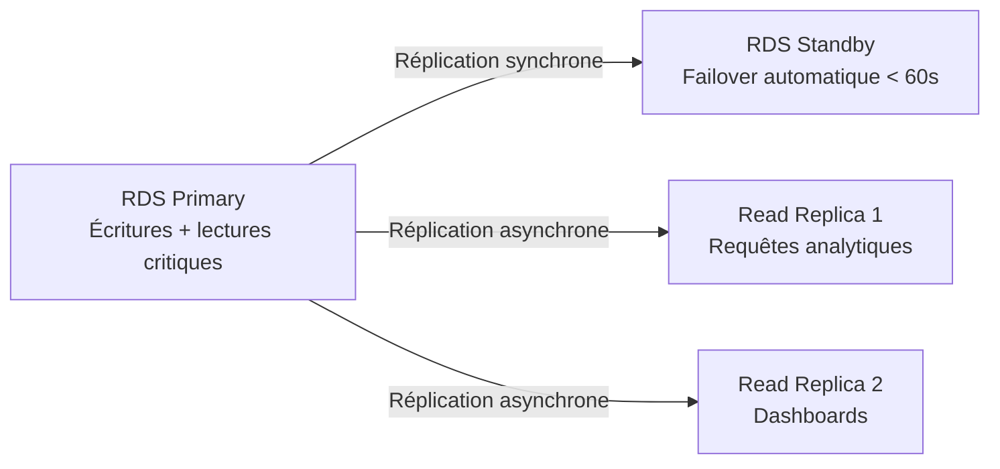
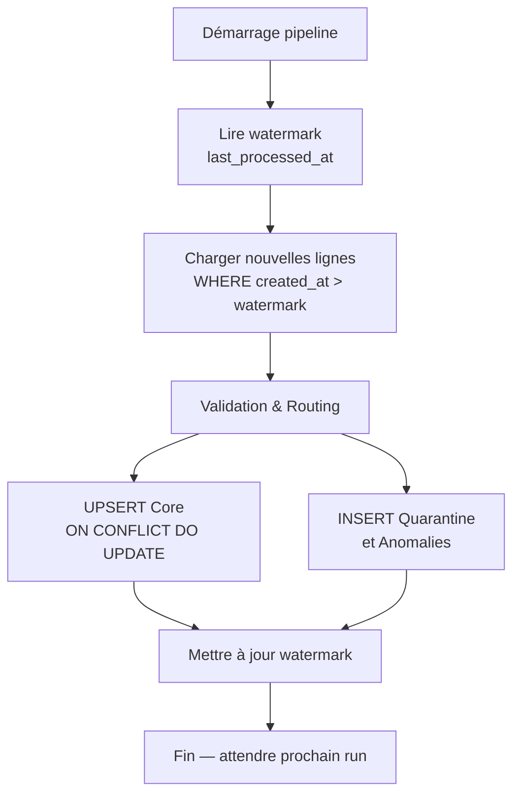
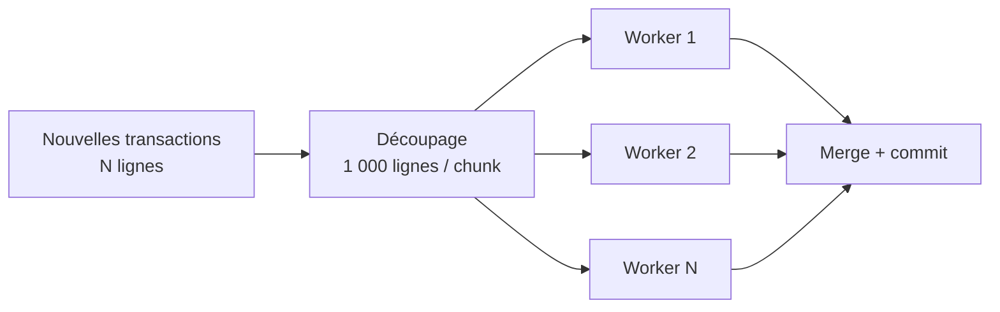
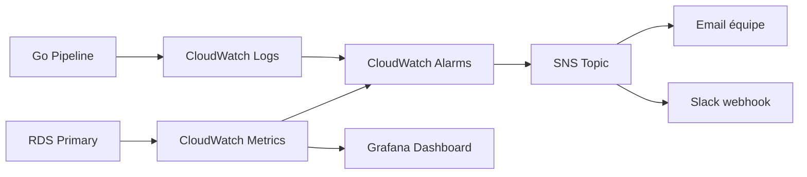
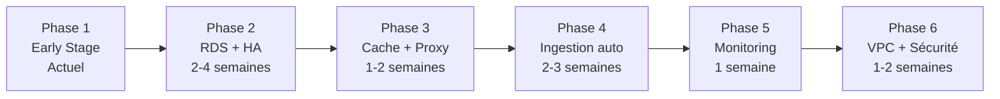

# At Scale Architecture — NAFAD PAY G1 OLTP Pipeline


## 1. Contexte et objectifs

### Présentation

Ce document décrit l'architecture **At Scale** cible du projet NAFAD PAY G1 OLTP.

Il répond à la question :

> *"Si ce système devait traiter des millions de transactions en production réelle, comment serait-il conçu ?"*

### Ordre de grandeur ciblé

| Dimension | Valeur At Scale |
|-----------|----------------|
| Débit nominal | 500 QPS en pic |
| Volume transactions | 5 millions tx/mois |
| Utilisateurs actifs | 500 000 |
| Disponibilité cible | 99.9% (< 9h downtime/an) |
| Latence API | < 200ms au P99 |
| Déploiement | Multi-datacenter (Multi-AZ) |

### Focus

> Scalabilité horizontale · Résilience · Cohérence (eventual vs strong) · Coût maîtrisé


## 2. Points de rupture de l'architecture Early Stage

Cette section identifie **où et pourquoi** l'architecture actuelle cassera avant d'atteindre les objectifs At Scale.

### Point de rupture 1 — PostgreSQL Docker sur EC2 unique

**Seuil de rupture estimé : ~5 000 transactions simultanées**

- Un seul nœud PostgreSQL sans réplication
- Panne EC2 = indisponibilité totale (0% HA)
- Pas de failover automatique
- Backups manuels uniquement

>  **Inacceptable** à 500 QPS avec 500k users — une panne de 10 minutes = des dizaines de milliers de transactions perdues.


### Point de rupture 2 — Pipeline TRUNCATE + retraitement complet

**Seuil de rupture estimé : ~500 000 lignes**

- Le `TRUNCATE` suivi du retraitement de toutes les données est O(n)
- Sur 5M tx/mois, un run complet prendrait des heures
- Impossible de traiter en temps quasi-réel
- Bloque la base pendant l'exécution

>  **Inacceptable** pour un système de paiement — les transactions doivent être validées en secondes, pas en heures.


### Point de rupture 3 — Absence de partitionnement

**Seuil de rupture estimé : ~10 millions de lignes**

- La table `core.transactions` sans partitionnement devient lente au-delà de quelques millions de lignes
- Les index perdent leur efficacité sans partitionnement
- Les requêtes de reporting sur des périodes longues scannent toute la table

>  **Inacceptable** à 5M tx/mois — après 6 mois, la table dépasse 30M de lignes.


### Point de rupture 4 — Ingestion CSV manuelle

**Seuil de rupture estimé : dès > 10 fichiers/jour**

- Les scripts bootstrap sont manuels et synchrones
- Pas de gestion des fichiers en échec
- Pas de déduplication à l'ingestion
- Impossible de gérer des flux temps réel

>  **Inacceptable** pour 500k users actifs générant des transactions en continu 24h/24.


### Point de rupture 5 — Absence de cache

**Seuil de rupture estimé : ~200 QPS**

- Chaque requête analytique frappe directement PostgreSQL
- Pas de cache pour les résultats fréquents (solde compte, historique récent)
- La base devient le goulot d'étranglement

>  **Inacceptable** à 500 QPS — PostgreSQL seul ne peut pas absorber ce débit sans cache.


### Point de rupture 6 — Absence de monitoring

**Seuil de rupture : immédiat en production**

- Aucune alerte si le pipeline échoue
- Aucune métrique de débit ou latence
- Les anomalies data passent inaperçues

>  **Inacceptable** dès le passage en production — impossible de garantir la qualité des données sans observabilité.


### Résumé des points de rupture

| Point de rupture | Seuil estimé | Impact |
|-----------------|-------------|--------|
| PostgreSQL Docker sans HA | 5 000 tx simultanées | Indisponibilité totale |
| TRUNCATE complet | 500 000 lignes | Pipeline bloquant |
| Absence partitionnement | 10 millions lignes | Requêtes lentes |
| Ingestion CSV manuelle | 10 fichiers/jour | Non scalable |
| Absence de cache | 200 QPS | Base saturée |
| Absence de monitoring | Dès la production | Anomalies non détectées |


## 3. Architecture cible

### Diagramme global



### Architecture réseau cible




## 4. Composants cibles

| Composant actuel | Composant cible | Justification |
|-----------------|----------------|---------------|
| PostgreSQL Docker sur EC2 | **AWS RDS PostgreSQL Multi-AZ** | HA, failover auto, backups managés |
| EC2 unique | **Auto Scaling Group (2 AZ)** | Résilience, pas de SPOF |
| Scripts CSV manuels | **AWS S3 + Kinesis + Glue** | Ingestion automatisée et temps réel |
| TRUNCATE complet | **Pipeline incrémental + watermark** | Scalable sur milliards de lignes |
| Pas de cache | **ElastiCache Redis** | Absorber 500 QPS sans saturer la DB |
| Connexions directes DB | **RDS Proxy** | Connection pooling, évite saturation |
| Pas de monitoring | **CloudWatch + Grafana + SNS** | Observabilité complète |
| Fichier `.env` | **AWS Secrets Manager** | Sécurité des credentials en production |


## 5. Base de données à grande échelle

### Partitionnement par date

```sql
-- Table partitionnée par trimestre
CREATE TABLE core.transactions (
    id            BIGSERIAL,
    amount        NUMERIC       NOT NULL,
    status        TEXT          NOT NULL,
    created_at    TIMESTAMP     NOT NULL,
    ...
) PARTITION BY RANGE (created_at);

-- Partitions trimestrielles
CREATE TABLE core.transactions_2024_q1
    PARTITION OF core.transactions
    FOR VALUES FROM ('2024-01-01') TO ('2024-04-01');

CREATE TABLE core.transactions_2024_q2
    PARTITION OF core.transactions
    FOR VALUES FROM ('2024-04-01') TO ('2024-07-01');

-- Partition par défaut pour les futures données
CREATE TABLE core.transactions_future
    PARTITION OF core.transactions
    DEFAULT;
```

**Bénéfices :**
- Les requêtes sur une période ne scannent que la partition concernée
- Archivage facile (détacher une partition = archiver un trimestre)
- Maintenance (VACUUM, ANALYZE) par partition

### Réplication



### Vues matérialisées pour le reporting

```sql
-- Rafraîchissement toutes les heures
CREATE MATERIALIZED VIEW core.daily_summary AS
SELECT
    DATE(created_at)      AS day,
    COUNT(*)              AS total_tx,
    SUM(amount)           AS total_volume,
    COUNT(*) FILTER (WHERE status = 'SUCCESS') AS success_count
FROM core.transactions
GROUP BY DATE(created_at);

CREATE UNIQUE INDEX ON core.daily_summary(day);

-- Rafraîchissement concurrent (sans bloquer les lectures)
REFRESH MATERIALIZED VIEW CONCURRENTLY core.daily_summary;
```


## 6. Pipeline incrémental

### Principe du watermark

Au lieu de retraiter toutes les données, le pipeline at scale ne traite que les **nouvelles lignes** depuis le dernier run.



### Traitement parallèle par chunks




## 7. Trade-offs explicites

### Trade-off 1 — Cohérence forte vs Disponibilité

| Option | Cohérence | Disponibilité | Latence | Choix retenu |
|--------|-----------|---------------|---------|-------------|
| RDS Multi-AZ synchrone | Forte  | Haute  | +5ms |  **Oui** |
| Read Replicas asynchrones | Eventual  | Très haute  | Meilleure |  Pour le reporting uniquement |
| Single node | Forte  | Faible  | Meilleure |  Non |

**Décision** : Cohérence forte sur les écritures (Multi-AZ synchrone) + eventual consistency acceptable sur les lectures analytiques (replicas asynchrones).

> Un système de paiement **ne peut pas** accepter de lire un solde périmé pour une transaction critique. En revanche, un dashboard de reporting peut afficher des données légèrement décalées (quelques secondes).


### Trade-off 2 — Coût vs Performance

| Composant | Coût mensuel estimé | Gain de performance |
|-----------|--------------------|--------------------|
| RDS Multi-AZ (db.t3.medium) | ~$60/mois | HA + failover automatique |
| RDS Read Replica x2 | ~$80/mois | Lectures distribuées |
| ElastiCache Redis (cache.t3.micro) | ~$25/mois | Absorbe 80% des lectures répétitives |
| RDS Proxy | ~$20/mois | Connection pooling (évite saturation) |
| CloudWatch + alertes | ~$15/mois | Observabilité complète |
| **Total At Scale** | **~$200-250/mois** | vs ~$30/mois en Early Stage |

**Décision** : Le surcoût de ~$220/mois est justifié pour 500k users et 5M tx/mois. Le coût par transaction descend à **~$0.00005/tx** — négligeable.


### Trade-off 3 — Complexité vs Maintenabilité

| Approche | Complexité | Maintenabilité | Choix |
|----------|-----------|----------------|-------|
| TRUNCATE complet (Early Stage) | Faible  | Très simple  |  Non scalable |
| Pipeline incrémental + watermark | Moyenne  | Requiert discipline  |  **Retenu** |
| Event sourcing complet | Élevée  | Complexe  |  Sur-ingénierie |

**Décision** : Le pipeline incrémental avec watermark est le bon compromis — il scale sans ajouter une complexité excessive. L'event sourcing serait une sur-ingénierie pour ce projet.


### Trade-off 4 — Streaming vs Batch

| Approche | Latence | Complexité | Coût | Choix |
|----------|---------|-----------|------|-------|
| Batch toutes les heures | Minutes | Faible | Bas |  **Retenu pour la majorité** |
| Streaming temps réel (Kinesis) | Secondes | Élevée | Moyen |  Pour les transactions critiques |
| Micro-batch (5 min) | Minutes | Moyenne | Moyen |  Compromis peu avantageux |

**Décision** : Architecture hybride — batch horaire pour le reporting, Kinesis pour les transactions à valider en temps réel (fraude, seuils).


## 8. Monitoring et observabilité

### Métriques à surveiller

| Métrique | Seuil d'alerte | Action déclenchée |
|----------|---------------|------------------|
| Taux d'anomalies | > 5% des transactions | Alerte SNS → équipe data |
| Taux de quarantine | > 30% des transactions | Alerte SNS → équipe data |
| Latence pipeline | > 10 minutes | Alerte SNS → DevOps |
| CPU RDS | > 70% | Scale up RDS |
| Connexions RDS | > 80% du max | RDS Proxy active le throttling |
| Lag réplication replica | > 30 secondes | Alerte SNS → DBA |

### Architecture monitoring




## 9. Plan de migration crédible

### Vue d'ensemble



### Détail des phases

**Phase 1 — Early Stage (actuel )**
- PostgreSQL Docker sur EC2
- Pipeline Go avec TRUNCATE
- Scripts bootstrap manuels

**Phase 2 — Migration vers RDS Multi-AZ**
- Créer instance RDS PostgreSQL Multi-AZ
- Migrer les données avec `pg_dump` + `pg_restore`
- Valider les données post-migration
- Basculer les connexions vers RDS
- Supprimer le conteneur Docker PostgreSQL
- *Risque* : downtime lors de la bascule → planifier en heures creuses

**Phase 3 — Ajout cache et connection pooling**
- Déployer ElastiCache Redis
- Configurer RDS Proxy
- Mettre en cache les soldes et l'historique récent
- *Risque* : cache invalidation — définir TTL appropriés

**Phase 4 — Pipeline incrémental + ingestion auto**
- Implémenter le watermark dans Go
- Configurer AWS S3 + Glue pour l'ingestion
- Activer Kinesis pour les flux temps réel
- *Risque* : double traitement pendant la transition → idempotence via `ON CONFLICT DO NOTHING`

**Phase 5 — Monitoring et observabilité**
- Configurer CloudWatch dashboards et alarms
- Déployer Grafana
- Configurer SNS pour les alertes email/Slack
- *Risque* : faux positifs → calibrer les seuils progressivement

**Phase 6 — Sécurisation réseau**
- Migrer vers VPC privé
- Passer à AWS Secrets Manager
- Activer CloudTrail pour l'audit
- *Risque* : changements réseau → tester en staging avant production


## 10. Comparaison Early Stage vs At Scale

| Aspect | Early Stage | At Scale |
|--------|-------------|----------|
| Débit | ≤ 50 QPS | 500 QPS en pic |
| Volume | < 1M lignes | 5M tx/mois |
| Base de données | PostgreSQL Docker | RDS Multi-AZ + Read Replicas |
| Disponibilité | ~95% (EC2 unique) | 99.9% (Multi-AZ) |
| Pipeline | TRUNCATE complet | Incrémental + watermark |
| Ingestion | CSV manuel | S3 + Kinesis + Glue |
| Cache | Aucun | ElastiCache Redis |
| Connection pooling | Aucun | RDS Proxy |
| Partitionnement | Aucun | Par trimestre |
| Monitoring | Aucun | CloudWatch + Grafana + SNS |
| Sécurité secrets | Fichier `.env` | AWS Secrets Manager |
| Réseau | EC2 public | VPC privé |
| Coût estimé | ~$30/mois | ~$200-250/mois |


## 11. Conclusion

L'architecture At Scale transforme NAFAD PAY d'un **pipeline de démonstration** en un **système de paiement production** capable de :

- absorber **500 QPS** en pic sans dégradation
- traiter **5 millions de transactions par mois**
- garantir **99.9% de disponibilité** grâce au Multi-AZ
- répondre aux exigences **multi-datacenter** via les Read Replicas
- rester **observable** avec CloudWatch et Grafana

Les trade-offs retenus privilégient la **cohérence forte sur les écritures** (système de paiement oblige), la **scalabilité horizontale** des lectures, et un **coût maîtrisé** (~$250/mois) proportionnel à la valeur générée par 500k utilisateurs actifs.

> *"L'architecture Early Stage prouve que le concept fonctionne. L'architecture At Scale prouve qu'il peut fonctionner en production."*
