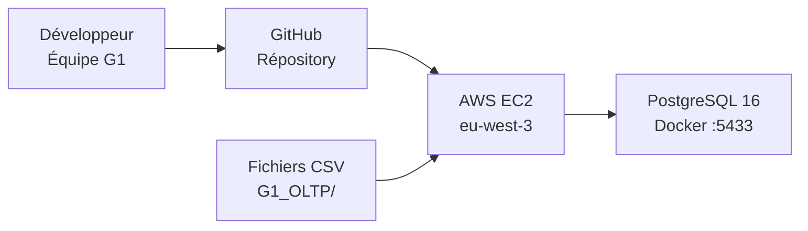
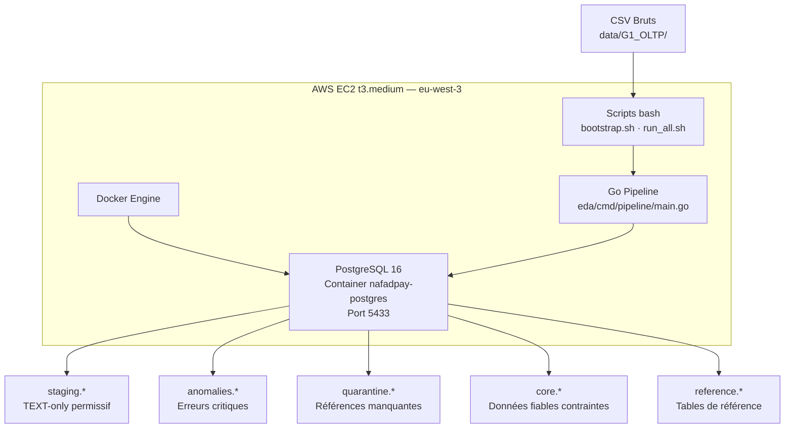
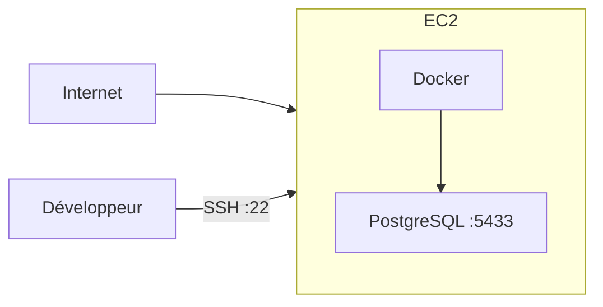
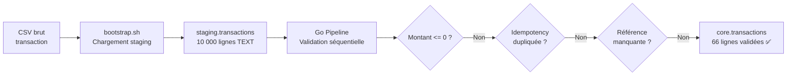
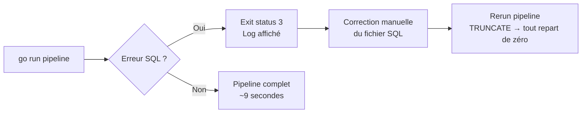

# Document d'Architecture — G1 OLTP — Early Stage


## 1. Contexte & contraintes

### Charge visée

| Dimension | Valeur Early Stage |
|-----------|-------------------|
| Débit | ≤ 50 QPS |
| Volume de données | < 1 million de lignes |
| Nombre de serveurs | 1 à 3 |
| Utilisateurs simultanés | < 100 |
| Latence p50 | < 500ms |
| Latence p99 | < 2s |

### SLA / SLO

| Indicateur | Valeur |
|-----------|--------|
| Disponibilité cible | ~95% (tolérance pannes planifiées) |
| RPO | 24h (backup manuel quotidien) |
| RTO | 2h (relance manuelle Docker) |

### Contraintes non-fonctionnelles

- Budget : minimal (compte AWS sandbox étudiant)
- Équipe : 5 membres, 10 jours
- Compliance : données synthétiques, pas de données personnelles réelles
- Aucune expérience opérationnelle RDS ou Aurora

### Hypothèses explicites

- Le volume de données reste < 1M de lignes pendant toute la phase Early Stage
- Un seul nœud PostgreSQL suffit pour ≤ 50 QPS
- La disponibilité 95% est acceptable en phase de développement
- Docker est disponible sur toutes les machines de l'équipe
- La latence Nouakchott ↔ Paris (~40-60ms) est acceptée — pas de cache edge en Early Stage


## 2. Diagramme d'architecture (C4 simplifié)

### Niveau 1 — System Context



### Niveau 2 — Containers



### Architecture réseau Early Stage



>  En Early Stage, l'EC2 a une IP publique et PostgreSQL est accessible via Docker. Ce n'est pas sécurisé pour la production — corrigé en At Scale avec VPC privé et RDS sans IP publique.


## 3. Choix techniques & alternatives rejetées (ADR-lite)

### ADR-01 — PostgreSQL Docker sur EC2 plutôt que RDS

**Contexte :** Phase de développement avec budget limité et équipe sans expérience RDS.

**Décision :** PostgreSQL 16 dans un conteneur Docker sur EC2 t3.medium.

**Alternatives rejetées :**
- *AWS RDS PostgreSQL* → coût ~$60/mois, configuration IAM complexe, délai de setup
- *AWS RDS Aurora* → sur-dimensionné pour < 50 QPS et < 1M lignes
- *Hetzner VPS* → 80% moins cher mais nécessite plus d'ops, pas de managed backup

**Justification :** Docker sur EC2 offre un setup en < 30 minutes, reproductible identiquement en local et sur EC2, avec un coût marginal (~$30/mois EC2 t3.medium).

**Conséquences :**
-  Setup rapide et reproductible
-  Identique en local et sur EC2
-  Pas de haute disponibilité (panne EC2 = downtime)
-  Backup manuel uniquement


### ADR-02 — Go pour l'orchestration du pipeline

**Contexte :** Le pipeline doit appliquer des règles de validation séquentielles avec gestion d'erreurs fiable sur le write-path.

**Décision :** Go 1.26 pour orchestrer l'exécution des fichiers SQL.

**Alternatives rejetées :**
- *Python* → le GIL sérialise l'exécution, typage dynamique moins adapté aux invariants monétaires stricts, risque de conditions de course sur le write-path
- *Scripts bash* → gestion d'erreurs limitée, difficile à maintenir au-delà de quelques étapes
- *Node.js* → event-loop single-threaded, gestion des flottants risquée pour de l'argent

**Justification :** Go est le bon choix pour le write-path concurrent d'un système de paiement — goroutines légères, GC court et prédictible, compile en un seul binaire statique facile à déployer. PostgreSQL pour le stockage, Go pour l'application qui écrit dedans — pas Python — car chaque transaction doit respecter des invariants monétaires stricts.

**Conséquences :**
-  Pipeline stable et reproductible en 12 étapes ordonnées
-  Gestion d'erreurs explicite (`exit status`)
-  Un seul binaire, déploiement trivial sur EC2
-  Nécessite Go installé sur l'environnement d'exécution


### ADR-03 — Staging TEXT-only sans contraintes

**Contexte :** Les données brutes contiennent des anomalies intentionnelles (phones dupliqués, idempotency keys dupliquées, montants invalides, références orphelines).

**Décision :** Toutes les colonnes staging sont de type `TEXT`, sans FK, UNIQUE, CHECK, ni NOT NULL.

**Alternatives rejetées :**
- *Staging typé avec contraintes* → rejette des lignes valides à cause d'artefacts CSV, perd de l'information

**Justification :** Le staging doit être exhaustif — toutes les anomalies intentionnelles doivent être préservées pour analyse et routage. La validation est déléguée au pipeline Go.

**Conséquences :**
-  Zéro perte de données à l'ingestion (10 000/10 000 lignes chargées)
-  Anomalies préservées pour détection
-  Staging seul non exploitable directement pour des requêtes fiables


### ADR-04 — Priorité ANOMALIES > QUARANTINE > CORE

**Contexte :** Une transaction peut avoir plusieurs problèmes simultanément (ex : montant invalide ET référence manquante). 16 transactions ont des anomalies multiples.

**Décision :** Appliquer une priorité stricte dans le routage.

**Alternatives rejetées :**
- *Routage multi-table* → une ligne dans plusieurs tables = incohérence des comptages

**Justification :** Déterminisme total du routage, zéro chevauchement garanti entre les tables.

**Conséquences :**
-  Overlap anomalies/quarantine = 0 (vérifié)
-  Routing auditables
-  Une transaction avec anomalie ET référence manquante va en anomalies uniquement


### ADR-05 — TRUNCATE complet avant chaque run

**Contexte :** En Early Stage, la reproductibilité prime sur la performance.

**Décision :** Chaque exécution du pipeline commence par un `TRUNCATE` de toutes les tables y compris `reference.*`.

**Alternatives rejetées :**
- *Mode incrémental* → complexité accrue, risque de doublons si mal géré

**Justification :** Idempotence totale — le pipeline est relançable indéfiniment sans erreur ni état corrompu. Validé : pipeline relancé plusieurs fois, résultats identiques.

**Conséquences :**
-  Reproductibilité totale
-  Non scalable sur volumes > 500k lignes (seuil de rupture — voir section 5)


### ADR-06 — 27 index justifiés par requête critique

**Contexte :** 20 requêtes analytiques identifiées, certaines très fréquentes (historique utilisateur, totaux journaliers).

**Décision :** 27 index dont 1 partiel (`idx_tx_merchant_status WHERE merchant_id IS NOT NULL`) et 1 composite node/sequence.

**Justification :** L'index partiel sur `merchant_id` évite d'indexer les 66 transactions TRF (tous `merchant_id = NULL`) — réduit la taille de l'index et accélère les requêtes marchands. Validé par EXPLAIN ANALYZE : Index Scan en 0.174ms sur Q1.

**Conséquences :**
-  Requêtes analytiques accélérées
-  Sur 66 lignes, PostgreSQL choisit parfois Seq Scan (normal — l'optimiseur bascule automatiquement sur l'index à partir de quelques milliers de lignes)


## 4. Flux critiques

### Happy path — transaction validée



### Gestion d'un échec / retry



Le pipeline est conçu pour échouer vite et fort (`RAISE EXCEPTION`) plutôt que de continuer silencieusement avec des données corrompues.

### Idempotence — comment est-elle garantie ?

Deux niveaux d'idempotence :

**Pipeline level :** `TRUNCATE` de toutes les tables avant chaque run → état initial garanti identique.

**Core level :** contrainte `UNIQUE` sur `idempotency_key` dans `core.transactions`. Validé par le bench concurrent : 10 workers × 1 000 inserts simultanés → 0 violation, 0 deadlock.


## 5. Points de rupture connus & seuils de bascule

### Point de rupture 1 — PostgreSQL Docker sans HA

**Seuil :** Dès la première panne EC2

**Signal déclencheur :** Panne EC2 non planifiée → downtime total

**Migration vers At Scale :** Migrer vers RDS Multi-AZ (failover automatique < 60s)


### Point de rupture 2 — Pipeline TRUNCATE complet

**Seuil estimé :** ~500 000 lignes

**Signal déclencheur :** Durée du pipeline > 30 minutes, CPU > 70% pendant le TRUNCATE

**Migration vers At Scale :** Pipeline incrémental avec watermark (`WHERE created_at > last_run`)


### Point de rupture 3 — Absence de partitionnement

**Seuil estimé :** ~10 millions de lignes dans `core.transactions`

**Signal déclencheur :** Requêtes de reporting > 5 secondes, Seq Scan sur toute la table

**Migration vers At Scale :** Partitionnement par `transaction_date` (trimestre)


### Point de rupture 4 — Connexions PostgreSQL saturées

**Seuil estimé :** ~200 QPS

**Signal déclencheur :** `max_connections` atteint, erreurs `too many connections`

**Migration vers At Scale :** RDS Proxy pour connection pooling


### Point de rupture 5 — Absence de monitoring

**Seuil :** Immédiat en production

**Signal déclencheur :** Anomalie pipeline non détectée, données core corrompues silencieusement

**Migration vers At Scale :** CloudWatch + Grafana + SNS alerts


### Tableau résumé

| Point de rupture | Seuil estimé | Signal de migration |
|-----------------|-------------|-------------------|
| PostgreSQL Docker sans HA | Première panne | Downtime > 10 min |
| TRUNCATE complet | 500k lignes | Pipeline > 30 min |
| Absence partitionnement | 10M lignes | Requêtes > 5s |
| Connexions saturées | 200 QPS | Erreurs `too many connections` |
| Absence monitoring | Dès la prod | Anomalie non détectée |


## 6. Risques & mitigations

### Risque 1 — Perte de données sur panne EC2

**Probabilité :** Moyenne | **Impact :** Élevé

**Description :** L'EC2 héberge PostgreSQL dans Docker avec stockage local. Une panne matérielle ou une résiliation accidentelle de l'instance efface toutes les données.

**Mitigation :** Backup manuel quotidien via `pg_dump` vers S3 :
```bash
pg_dump -U admin nafadpay | gzip > backup_$(date +%Y%m%d).sql.gz
aws s3 cp backup_*.sql.gz s3://nafadpay-backups/
```


### Risque 2 — Secret exposé dans le code ou Git

**Probabilité :** Élevée (erreur humaine fréquente) | **Impact :** Élevé

**Description :** Credentials AWS ou mot de passe PostgreSQL commités accidentellement dans Git.

**Mitigation :**
- `.gitignore` inclut `.env`, `terraform.tfvars`, `*.pem`
- Variables d'environnement via `.env` jamais commité
- Scan Git avec `git-secrets` ou `truffleHog` avant chaque push
- En At Scale : AWS Secrets Manager remplace tous les fichiers `.env`


### Risque 3 — Données core corrompues par bug pipeline

**Probabilité :** Faible (pipeline validé) | **Impact :** Élevé

**Description :** Un bug dans les règles de routage laisse passer des transactions invalides dans `core`.

**Mitigation :**
- 7 checks de validation automatiques après chaque run (`nafadpay_validate_pipeline.sql`)
- Q18, Q19, Q20 : business rule tests qui doivent retourner 0 lignes
- Bench concurrent : 10 workers × 1 000 inserts, 0 violation de contrainte
- Pipeline idempotent : en cas de doute, `docker compose down -v && bootstrap.sh && run_all.sh`


## 7. Résultats obtenus

### Volume de données

| Table | Lignes |
|-------|--------|
| `staging.transactions` | 10 000 |
| `staging.users` | 1 000 |
| `staging.accounts` | 1 099 |
| `staging.merchants` | 100 |
| `staging.agencies` | 50 |

### Pipeline routing

| Couche | Lignes | % du brut |
|--------|--------|-----------|
| `anomalies.idempotency_conflicts` | 6 416 | 64.16% |
| `anomalies.transaction_anomalies` | 52 | 0.52% |
| `quarantine.quarantine_transactions` | 3 505 | 35.05% |
| `core.transactions` | 66 | 0.66% |

### Core (données fiables)

| Table | Lignes |
|-------|--------|
| `core.users` | 995 |
| `core.accounts` | 1 087 |
| `core.merchants` | 100 |
| `core.agencies` | 50 |
| `core.transactions` | 66 (40 SUCCESS · 26 FAILED) |
| `quarantine.quarantine_reasons` | 7 |
| `reference.wilayas` | 15 |
| `reference.tx_types` | 8 |
| `reference.categories` | 13 |

### Validations — toutes passées

| Check | Résultat |
|-------|---------|
| Doublons idempotency_key dans core | 0  |
| FAILED tx avec changement de solde | 0  |
| Montants négatifs dans core | 0  |
| Soldes négatifs dans core | 0  |
| Violations FK lors de l'insertion | 0  |
| Overlap anomalies / quarantine | 0  |
| Noms marchands avec préfixe `undefined` | 0  |
| 27 index présents dont 1 partiel |  |
| Pipeline idempotent (relançable sans erreur) |  |

### Performance (EXPLAIN ANALYZE)

| Requête | Plan | Temps |
|---------|------|-------|
| Q1 — historique utilisateur | Index Scan `idx_accounts_user` | 0.174ms  |
| Q4 — lookup par référence | Index Scan `transactions_reference_key` | < 0.1ms  |
| Q13 — totaux quotidiens | Seq Scan (normal sur 66 lignes) | 0.240ms  |

### Bench concurrent

| Métrique | Résultat |
|----------|---------|
| Workers | 10 parallèles |
| Total inserts | 10 000 / 10 000  |
| Violations `UNIQUE` idempotency | 0  |
| Violations CHECK | 0  |
| Deadlocks | 0  |


*NAFAD-PAY G1 OLTP — Document Early Stage — Mai 2026*
