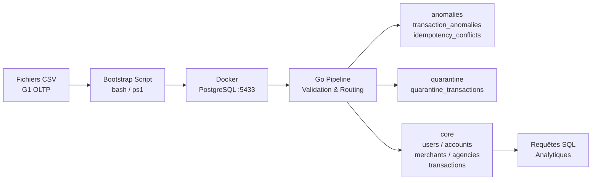
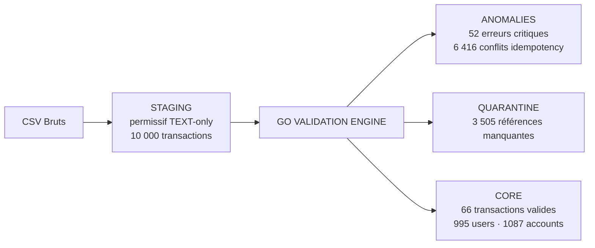
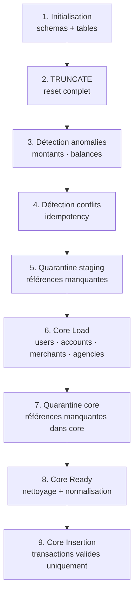

# Early Stage Architecture — NAFAD PAY G1 OLTP Pipeline


## 1. Contexte et objectifs

### Présentation

Ce document décrit l'architecture **Early Stage** du projet NAFAD PAY G1 OLTP.

Il correspond à la première version opérationnelle du système, conçue pour :

- fonctionner **maintenant**, avec l'équipe et les moyens actuels
- rester **simple**, rapide à mettre en place et facile à maintenir
- être **reproductible** par n'importe quel membre de l'équipe

### Ordre de grandeur ciblé

| Dimension | Valeur Early Stage |
|-----------|-------------------|
| Débit | ≤ 50 QPS |
| Volume de données | < 1 million de lignes |
| Nombre de serveurs | 1 à 3 |
| Utilisateurs simultanés | < 100 |
| Latence acceptable | < 2 secondes |

### Focus

> Simplicité · Time-to-market · Observabilité minimale


## 2. Architecture globale

### Diagramme



### Flux de données




## 3. Composants techniques

### Infrastructure

| Composant | Technologie | Rôle |
|-----------|-------------|------|
| Base de données | PostgreSQL 16 (Docker) | Stockage de toutes les couches |
| Orchestration | Go 1.26 | Moteur du pipeline de validation |
| Conteneurisation | Docker + docker-compose | Environnement reproductible |
| Versionnage | Git + GitHub | Collaboration et historique |
| Automatisation | Scripts `.sh` / `.ps1` | Bootstrap et exécution pipeline |
| Cloud | AWS EC2 t3.medium | Hébergement production |

### Schémas PostgreSQL

| Schéma | Rôle | Type |
|--------|------|------|
| `staging` | Chargement brut exhaustif | Permissif (TEXT-only) |
| `reference` | Données de référence | Strict |
| `core` | Données valides et fiables | Strict (FK + CHECK) |
| `anomalies` | Erreurs critiques détectées | Informatif |
| `quarantine` | Références manquantes | Informatif |


## 4. Choix techniques justifiés (ADR-lite)

### ADR-01 — PostgreSQL en Docker plutôt que service managé

**Contexte** : Le projet est en phase de développement avec un budget limité et une équipe de 5 étudiants.

**Décision** : Utiliser PostgreSQL 16 dans un conteneur Docker sur EC2.

**Justification** :
- Coût nul (pas de frais RDS)
- Setup en < 5 minutes avec docker-compose
- Comportement identique en local et sur EC2
- Suffisant pour < 1M de lignes et ≤ 50 QPS

**Conséquences** :
-  Reproductibilité totale (même image Docker partout)
-  Reset facile (`docker compose down -v && docker compose up -d`)
-  Pas de haute disponibilité ni de failover automatique
-  Backup manuel uniquement


### ADR-02 — Staging TEXT-only sans contraintes

**Contexte** : Les données brutes contiennent des anomalies connues (phones dupliqués, idempotency keys dupliquées, montants invalides).

**Décision** : Toutes les colonnes staging sont de type `TEXT`, sans FK, UNIQUE, CHECK, ni NOT NULL.

**Justification** :
- Garantit qu'aucune ligne n'est perdue pendant le chargement
- Les anomalies sont préservées pour analyse ultérieure
- La validation est déléguée à une couche dédiée (Go pipeline)

**Conséquences** :
-  Zéro perte de données à l'ingestion
-  Staging = copie fidèle des CSV sources
-  Staging seul n'est pas exploitable directement pour des requêtes fiables


### ADR-03 — Go comme moteur d'orchestration

**Contexte** : Le pipeline doit appliquer des règles de validation séquentielles et insérer dans plusieurs tables dans le bon ordre.

**Décision** : Utiliser Go pour orchestrer l'exécution des fichiers SQL.

**Justification** :
- Gestion d'erreurs explicite et fiable (`exit status`)
- Performance supérieure à Python pour l'orchestration
- Un seul binaire, facile à déployer sur EC2
- Lisibilité du code pour toute l'équipe

**Conséquences** :
-  Pipeline stable et reproductible
-  Ordre d'exécution garanti
-  Nécessite Go installé sur l'environnement d'exécution


### ADR-04 — TRUNCATE complet avant chaque run

**Contexte** : En early stage, la reproductibilité prime sur la performance.

**Décision** : Chaque exécution du pipeline commence par un `TRUNCATE` de toutes les tables.

**Justification** :
- Garantit des résultats identiques à chaque run
- Évite les doublons et les états intermédiaires corrompus
- Simplifie le debugging (on repart toujours de zéro)

**Conséquences** :
-  Idempotence totale du pipeline
-  Debugging simplifié
-  Incompatible avec un mode incrémental (prévu en At Scale)


### ADR-05 — Priorité ANOMALIES > QUARANTINE > CORE

**Contexte** : Une transaction peut avoir plusieurs problèmes simultanément (ex : montant invalide ET référence manquante).

**Décision** : Appliquer une priorité stricte dans le routage.

**Justification** :
- Garantit qu'aucune ligne n'appartient à deux catégories
- Déterminisme total du routage
- Cohérence des comptages pour les validations

**Conséquences** :
-  Zéro chevauchement entre les tables (validé : overlap = 0)
-  Routing déterministe et auditable
-  Une transaction avec anomalie ET référence manquante va en anomalies uniquement


### ADR-06 — Indexation des tables core

**Contexte** : Les requêtes analytiques portent systématiquement sur les mêmes colonnes (compte, date, statut, marchand).

**Décision** : Créer 15 index sur les tables core (simples et composites).

**Justification** :
- Réduction de la complexité de recherche de O(n) à O(log n)
- Index composites pour les requêtes multi-critères fréquentes (compte + date, statut + date)
- Coût acceptable en early stage (volume < 1M lignes)

**Index créés :**

| Table | Index | Type |
|-------|-------|------|
| `core.transactions` | `idx_tx_source_account` | Simple |
| `core.transactions` | `idx_tx_destination_account` | Simple |
| `core.transactions` | `idx_tx_merchant` | Simple |
| `core.transactions` | `idx_tx_agency` | Simple |
| `core.transactions` | `idx_tx_date` | Simple |
| `core.transactions` | `idx_tx_status` | Simple |
| `core.transactions` | `idx_tx_account_date` | Composite |
| `core.transactions` | `idx_tx_status_date` | Composite |
| `core.transactions` | `idx_tx_merchant_status` | Composite |
| `core.accounts` | `idx_accounts_user` | Simple |
| `core.accounts` | `idx_accounts_status` | Simple |
| `core.users` | `idx_users_wilaya` | Simple |
| `core.merchants` | `idx_merchants_wilaya` | Simple |
| `core.merchants` | `idx_merchants_category` | Simple |
| `core.agencies` | `idx_agencies_wilaya` | Simple |

**Conséquences** :
-  Requêtes analytiques accélérées (ex: Q1 historique utilisateur → 0.174ms avec index scan)
-  Index composites optimisent les requêtes multi-critères
-  Sur 66 lignes, PostgreSQL choisit parfois un seq scan (normal — l'optimiseur bascule automatiquement sur l'index à partir de quelques milliers de lignes)
-  Les index occupent plus de place que les données sur petit volume (192 kB index vs 24 kB données pour transactions — ratio normal en production)


## 5. Pipeline de validation

### Ordre d'exécution



### Règles de validation appliquées

| Règle | Type | Destination |
|-------|------|-------------|
| `amount ≤ 0` | Anomalie critique | `anomalies.transaction_anomalies` |
| `balance_after` invalide après FAILED | Anomalie critique | `anomalies.transaction_anomalies` |
| `balance` négative | Anomalie critique | `anomalies.transaction_anomalies` |
| `idempotency_key` dupliquée + payload différent | Anomalie critique | `anomalies.idempotency_conflicts` |
| `source_account` manquant | Quarantine | `quarantine.quarantine_transactions` |
| `destination_account` manquant | Quarantine | `quarantine.quarantine_transactions` |
| Référence core manquante | Quarantine | `quarantine.quarantine_transactions` |
| Tout le reste | Valide | `core.transactions` |


## 6. Résultats obtenus

### Volume de données

| Table | Lignes chargées |
|-------|----------------|
| `staging.users` | 1 000 |
| `staging.accounts` | 1 099 |
| `staging.merchants` | 100 |
| `staging.agencies` | 50 |
| `staging.transactions` | 10 000 |
| `staging.reference_wilayas` | 15 |
| `staging.reference_tx_types` | 8 |
| `staging.reference_categories` | 13 |

### Résultats du pipeline

| Table | Lignes |
|-------|--------|
| `anomalies.transaction_anomalies` | 52 |
| `anomalies.idempotency_conflicts` | 6 416 |
| `quarantine.quarantine_transactions` | 3 505 |
| `core.users` | 995 |
| `core.accounts` | 1 087 |
| `core.merchants` | 100 |
| `core.agencies` | 50 |
| `core.transactions` | 66 |

### Détail des anomalies

| Type d'anomalie | Nombre |
|----------------|--------|
| `invalid_amount` (montant ≤ 0) | 5 |
| `invalid_failed_balance` | 28 |
| `negative_balance` | 19 |
| **Total transaction_anomalies** | **52** |
| Conflits idempotency | 6 416 |

### Détail de la quarantine

| Type | Nombre |
|------|--------|
| `missing_source_account` | 579 |
| `missing_destination_account` | 2 925 |
| `missing_core_reference` | 1 |
| **Total quarantine** | **3 505** |

### Validations de non-chevauchement

| Vérification | Résultat |
|-------------|---------|
| Overlap anomalies / quarantine | 0  |
| Overlap idempotency / quarantine | 0  |
| Montants invalides dans core | 0  |
| Balances invalides dans core | 0  |
| Références manquantes dans core | 0  |
| Violations FK lors de l'insertion | 0  |

### Validation business logic

| Règle | Résultat |
|-------|---------|
| `FAILED` → `completed_at = NULL` |  Vérifié |
| `SUCCESS` → `completed_at NOT NULL` |  Vérifié |

### Distribution des statuts dans core.transactions

| Statut | Nombre | % |
|--------|--------|---|
| SUCCESS | 40 | 60.6% |
| FAILED | 26 | 39.4% |

> Les 26 transactions FAILED dans core sont **normales** — elles ont passé la validation structurelle mais ont échoué pour des raisons métier (fonds insuffisants, etc.). Elles sont conservées dans core pour l'historique.


## 7. Reproductibilité

### En une seule commande (bootstrap)

```bash
# Linux / EC2
bash scripts/bootstrap.sh

# Windows
.\scripts\bootstrap.ps1
```

### Puis lancer le pipeline

```bash
go run eda/cmd/pipeline/main.go
```

### Vérifier les résultats

```bash
# Smoke test staging
docker exec -i nafadpay-postgres psql -U admin -d nafadpay \
  -f sql/tests/00_staging_smoke_test.sql

# Tests de validation
docker exec -i nafadpay-postgres psql -U admin -d nafadpay \
  -f sql/tests/01_validation_routing_checks.sql
```


## 8. Limitations connues

| Limitation | Impact | Solution prévue (At Scale) |
|------------|--------|---------------------------|
| PostgreSQL sans HA | Panne = indisponibilité totale | RDS Multi-AZ |
| TRUNCATE complet à chaque run | Non scalable sur gros volumes | Mode incrémental avec watermark |
| Pas de monitoring | Anomalies pipeline non détectées en temps réel | CloudWatch + alertes SNS |
| 66 transactions en core / 10 000 | Taux faible dû aux conflits idempotency (64.2%) | Résolution des conflits |
| Pas de tests unitaires Go | Régression difficile à détecter | Tests unitaires par règle |
| 0 transactions marchandes dans core | Requêtes analytiques marchands vides | À corriger dans les règles pipeline (Membre 3) |
| 349 comptes avec available_balance > balance | Incohérence données sources | À corriger dans le schéma core (Membre 1) |
| Noms marchands affichant "undefined" | Données CSV mal générées | À corriger dans les données sources (Membre 1) |


## 9. Conclusion

L'architecture Early Stage atteint ses objectifs :

-  Pipeline fonctionnel et reproductible
-  Séparation stricte core / quarantine / anomalies
-  Zéro chevauchement entre les catégories
-  Données core fiables et contraintes
-  Setup en une commande sur n'importe quel environnement

> *"staging is exhaustive — core is trusted"*

Cette base solide permet d'envisager sereinement la montée en charge décrite dans le document **At Scale**.
